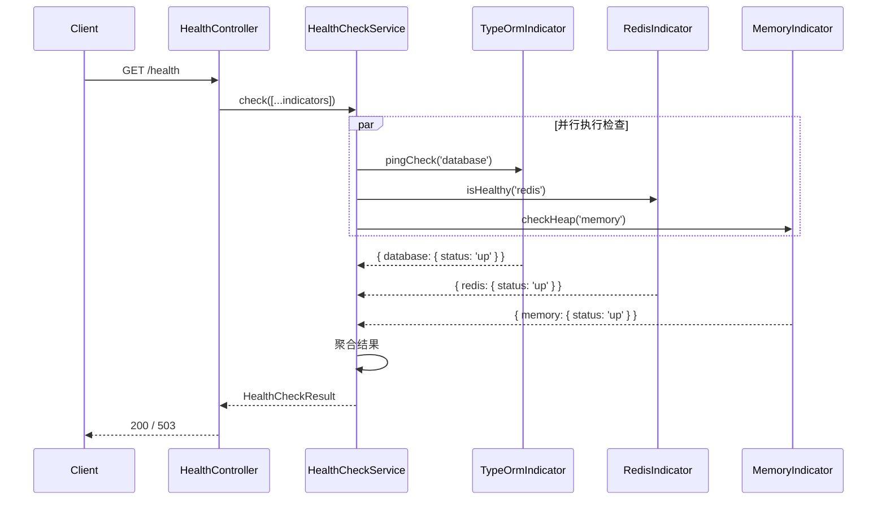

# 031. 健康检查与监控 (Health Checks)

## 1. 核心问题与概念

### 解决什么问题

在生产环境中，应用依赖多个外部服务（数据库、缓存、消息队列等）。当某个依赖出现故障时，运维需要：

1. **快速定位**：哪个服务出了问题？
2. **自动恢复**：容器编排平台（K8s）需要知道何时重启/替换容器
3. **流量切换**：负载均衡需要知道哪些实例是健康的

健康检查 (Health Check) 提供了一套标准化的方式来暴露应用及其依赖的状态。

### 核心概念与依赖

| 概念                           | 说明                                                  |
| ------------------------------ | ----------------------------------------------------- |
| **Health Indicator**     | 健康指示器，负责检查单个依赖（如数据库、Redis）的状态 |
| **Health Check Service** | 聚合所有指示器的检查结果，输出统一格式的响应          |
| **Liveness Probe**       | 存活探针，回答"进程是否还活着？"                      |
| **Readiness Probe**      | 就绪探针，回答"应用是否准备好接收流量？"              |

**@nestjs/terminus**：NestJS 官方健康检查模块，提供：

- 内置指示器：TypeORM、Mongoose、Redis (需 redis 客户端)、Disk、Memory、HTTP 等
- 标准化响应格式
- 与 Swagger 集成

## 2. 核心用法 / 方案设计 (Usage / Design)

### 端点设计

| 端点                      | 用途         | 检查内容                |
| ------------------------- | ------------ | ----------------------- |
| `GET /health`           | 完整状态     | 所有依赖 + 磁盘 + 内存  |
| `GET /health/liveness`  | K8s 存活探针 | 仅返回 200 (无依赖检查) |
| `GET /health/readiness` | K8s 就绪探针 | 核心依赖 (DB + Redis)   |

### 响应格式

```json
{
  "status": "ok",
  "info": {
    "database": { "status": "up" },
    "redis": { "status": "up" },
    "storage": { "status": "up" },
    "memory_heap": { "status": "up" }
  },
  "error": {},
  "details": {
    "database": { "status": "up" },
    "redis": { "status": "up" },
    "storage": { "status": "up" },
    "memory_heap": { "status": "up" }
  }
}
```

当某个检查失败时：

- HTTP 状态码变为 `503 Service Unavailable`
- `status` 变为 `"error"`
- 失败的检查项会出现在 `error` 字段中

## 3. 深度原理与机制 (Under the Hood)

### 执行流程



### 自定义 Health Indicator

Terminus 内置的指示器不一定覆盖所有场景（如我们使用 `ioredis` 而非官方 `redis` 客户端），此时需要自定义。

> ⚠️ **注意**: `@nestjs/terminus` v11.0.0 起，`HealthIndicator` 基类和 `HealthCheckError` 已弃用，改用 `HealthIndicatorService`。

```typescript
@Injectable()
export class RedisHealthIndicator {
  constructor(
    private readonly healthIndicatorService: HealthIndicatorService,
    @Inject(REDIS_CLIENT) private readonly redis: Redis,
  ) {}

  async isHealthy(key: string) {
    const indicator = this.healthIndicatorService.check(key);

    try {
      const response = await this.redis.ping();
      const isHealthy = response === 'PONG';

      if (isHealthy) {
        return indicator.up();
      }
      return indicator.down();
    } catch (error) {
      return indicator.down({ message: error.message });
    }
  }
}
```

**关键点**：

- 注入 `HealthIndicatorService` (不再继承基类)
- 调用 `healthIndicatorService.check(key)` 获取 indicator 实例
- 使用 `indicator.up()` 表示健康，`indicator.down(details)` 表示异常
- ⚠️ **不要覆盖 `status` 字段**：Terminus 依赖 `status: 'up' | 'down'` 来聚合结果，若传入 `{ status: 'xxx' }` 会导致该指标从响应中丢失

### 磁盘和内存检查阈值

```typescript
// 磁盘：当使用率超过 90% 时，检查失败
this.disk.checkStorage('storage', {
  path: process.cwd(),
  thresholdPercent: 0.9,
})

// 内存：当堆内存超过 300MB 时，检查失败
this.memory.checkHeap('memory_heap', 300 * 1024 * 1024)
```

## 4. 最佳实践与坑 (Best Practices & Pitfalls)

### ✅ 推荐做法

1. **健康检查端点必须公开**：使用 `@Public()` 装饰器跳过认证
2. **Liveness 探针保持轻量**：不检查外部依赖，仅验证进程存活
3. **Readiness 探针检查核心依赖**：数据库、缓存等必须可用才算就绪
4. **设置合理的阈值**：磁盘/内存阈值需根据实际情况调整
5. **Swagger 集成**：使用 `@ApiTags` 和 `@ApiOperation` 方便调试

### ❌ 避免做法

1. **不要在 Liveness 中检查外部依赖**：否则数据库短暂不可用会导致容器重启风暴
2. **不要暴露敏感信息**：健康检查响应不应包含密码、连接字符串等
3. **不要忽略超时**：长时间的检查会拖慢响应，考虑设置超时
4. **不要检查过于频繁**：K8s 探针间隔建议 10-30 秒
5. **不要覆盖 `status` 字段**：在 `indicator.up()` 或 `indicator.down()` 中传入 `{ status: 'xxx' }` 会覆盖 Terminus 内部的状态标识，导致该指标从聚合结果中丢失

### K8s 探针配置示例

```yaml
livenessProbe:
  httpGet:
    path: /health/liveness
    port: 3000
  initialDelaySeconds: 30
  periodSeconds: 10

readinessProbe:
  httpGet:
    path: /health/readiness
    port: 3000
  initialDelaySeconds: 5
  periodSeconds: 10
```

## 5. 行动导向 (Action Guide)

### Step 1: 安装依赖

**这一步在干什么**: 安装 NestJS 官方健康检查模块 `@nestjs/terminus`。

```bash
npm install @nestjs/terminus
```

### Step 2: 创建自定义 Redis 健康指示器

**这一步在干什么**: 由于项目使用 `ioredis` 客户端，Terminus 没有内置支持，需要自定义指示器来检查 Redis 连接状态。使用 `HealthIndicatorService` (v11+ 推荐方式)。

文件路径: `src/common/health/indicators/redis.indicator.ts`

```typescript
import { Injectable, Inject } from '@nestjs/common';

import { HealthIndicatorService } from '@nestjs/terminus';
import Redis from 'ioredis';

import { REDIS_CLIENT } from '../../redis/redis.module';

/**
 * 自定义 Redis 健康指示器
 * 使用 HealthIndicatorService (v11+) 基类
 */
@Injectable()
export class RedisHealthIndicator {
  constructor(
    private readonly healthIndicatorService: HealthIndicatorService,
    @Inject(REDIS_CLIENT) private readonly redis: Redis,
  ) {}

  /**
   * 检查 Redis 连接状态
   * @param key - 在健康检查结果中显示的标识符
   */
  async isHealthy(key: string) {
    const indicator = this.healthIndicatorService.check(key);

    try {
      // PING 是 Redis 最轻量的健康检查命令
      const response = await this.redis.ping();
      const isHealthy = response === 'PONG';

      if (isHealthy) {
        // 不要覆盖 status 字段，Terminus 依赖 status: 'up' 来判断健康状态
        return indicator.up();
      }

      return indicator.down();
    } catch (error) {
      // 捕获连接错误等异常情况
      return indicator.down({
        message: error instanceof Error ? error.message : 'Unknown error',
      });
    }
  }
}

```

### Step 3: 创建健康检查控制器

**这一步在干什么**: 定义健康检查的 HTTP 端点，聚合各个指示器的检查结果。

文件路径: `src/common/health/health.controller.ts`

```typescript
import { Controller, Get } from '@nestjs/common';
import { ApiTags, ApiOperation } from '@nestjs/swagger';
import {
  HealthCheckService,
  HealthCheck,
  TypeOrmHealthIndicator,
  DiskHealthIndicator,
  MemoryHealthIndicator,
} from '@nestjs/terminus';
import { Public } from '../decorators/public.decorator';
import { RedisHealthIndicator } from './indicators/redis.indicator';

/**
 * 健康检查控制器
 * 提供多个端点用于不同场景的健康检查
 */
@ApiTags('Health Check')
@Controller('health')
export class HealthController {
  constructor(
    private readonly health: HealthCheckService,
    private readonly db: TypeOrmHealthIndicator,
    private readonly disk: DiskHealthIndicator,
    private readonly memory: MemoryHealthIndicator,
    private readonly redis: RedisHealthIndicator,
  ) {}

  /**
   * 完整健康检查
   * 适用于运维监控面板，包含所有依赖服务的状态
   */
  @Get()
  @Public()
  @HealthCheck()
  @ApiOperation({ summary: '完整健康检查 (所有服务)' })
  check() {
    return this.health.check([
      // PostgreSQL 数据库检查
      () => this.db.pingCheck('database'),

      // Redis 服务检查
      () => this.redis.isHealthy('redis'),

      // 磁盘空间检查 (阈值: 使用率超过 90% 告警)
      () =>
        this.disk.checkStorage('storage', {
          path: process.cwd(),
          thresholdPercent: 0.9,
        }),

      // 内存检查 (阈值: 堆内存超过 300MB 告警)
      () => this.memory.checkHeap('memory_heap', 300 * 1024 * 1024),
    ]);
  }

  /**
   * 存活探针 (Liveness Probe)
   * 适用于 Kubernetes/Docker，仅检查应用进程是否存活
   * 此端点响应极快，不检查外部依赖
   */
  @Get('liveness')
  @Public()
  @ApiOperation({ summary: '存活探针 (K8s Liveness)' })
  liveness() {
    return { status: 'ok', timestamp: new Date().toISOString() };
  }

  /**
   * 就绪探针 (Readiness Probe)
   * 适用于 Kubernetes/Docker，检查核心依赖是否就绪
   * 数据库和缓存必须可用，应用才算就绪
   */
  @Get('readiness')
  @Public()
  @HealthCheck()
  @ApiOperation({ summary: '就绪探针 (K8s Readiness)' })
  readiness() {
    return this.health.check([
      () => this.db.pingCheck('database'),
      () => this.redis.isHealthy('redis'),
    ]);
  }
}

```

### Step 4: 创建健康检查模块

**这一步在干什么**: 将控制器和自定义指示器封装为独立模块。

文件路径: `src/common/health/health.module.ts`

```typescript
import { Module } from '@nestjs/common';

import { TerminusModule } from '@nestjs/terminus';

import { HealthController } from './health.controller';
import { RedisHealthIndicator } from './indicators/redis.indicator';

/**
 * 健康检查模块
 * 集成 @nestjs/terminus 并注册自定义指示器
 */
@Module({
  imports: [TerminusModule],
  controllers: [HealthController],
  providers: [RedisHealthIndicator],
})
export class HealthModule {}

```

### Step 5: 集成到 AppModule

**这一步在干什么**: 将健康检查模块注册到应用根模块。

文件路径: `src/app.module.ts`

```typescript
import { HealthModule } from './common/health/health.module';

@Module({
  imports: [
    // ... 其他模块
    HealthModule,
  ],
})
export class AppModule {}
```

### Step 6: 验证功能

**这一步在干什么**: 启动应用并测试健康检查端点。

```bash
# 启动应用
npm run dev

# 测试完整健康检查
curl http://localhost:3000/health

# 测试存活探针
curl http://localhost:3000/health/liveness

# 测试就绪探针
curl http://localhost:3000/health/readiness
```

预期响应 (所有服务正常):

```json
{
  "status": "ok",
  "info": {
    "database": {
      "status": "up"
    },
    "redis": {
      "status": "up"
    },
    "storage": {
      "status": "up"
    },
    "memory_heap": {
      "status": "up"
    }
  },
  "error": {},
  "details": {
    "database": {
      "status": "up"
    },
    "redis": {
      "status": "up"
    },
    "storage": {
      "status": "up"
    },
    "memory_heap": {
      "status": "up"
    }
  }
}
```
