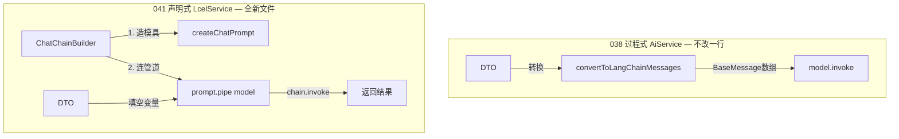

# 041. LCEL 管道与提示词工程 (Prompt Template & LCEL)

## 0. 架构师的真实视角：ROI 分析 (The Real World ROI)

**真实感受：** 
在使用基础的 `model.invoke(messages)` 时，你可能会觉得非常直观和舒服："构建应用就这么简单，为什么非要搞个『管道』把事情搞复杂？代码量看起来反而变多了！"

**这是一个非常敏锐且真实的工程师直觉。** 
在简单的单次/多轮对话场景下，引入 LCEL（LangChain Expression Language）确实是在做**"前期过度投资"**。当只生产一个水杯时，手工做远比搭流水线快；但当你需要生产带包装、带质检、应对断电容灾的复杂产品时，流水线的威力才会显现。

**真实场景下的价值体现：**

1. **结构化输出解析 (042 章节)**：
   - *不用管道*：自己写正则截取大模型返回的 JSON 字符串，自己 `JSON.parse`，自己 catch 异常。
   - *用管道*：`prompt.pipe(model).pipe(StructuredOutputParser)`。文本流过 Parser 后，出来的直接就是强类型的 TypeScript 对象。
2. **生产级的高可用与容灾 (046 章节)**：
   - *不用管道*：在业务代码里写臃肿的 `try-catch`、循环重试逻辑和 if-else 备用模型切换。
   - *用管道*：`prompt.pipe(deepseek).withRetry({ stopAfterAttempt: 3 }).withFallbacks([qwen])`。几行代码赋予整个链路极强的生产级韧性。
3. **统一的流式接口**：
   - *不用管道*：每次增加逻辑，流式分发（SSE）的底层代码都要大改。
   - *用管道*：因为有了统一的 `Runnable` 协议，无论里面串了多少个模型、解析器，最外层永远是 `chain.stream()`，对外暴露的 SSE 方法永远不用改一行代码。
4. **LangGraph 智能体底座**：
   - LangGraph（有状态智能体框架）的底层完全构建在 Runnable 协议之上。这里的学习是通往复杂智能体网络的必经之路。

**顶级架构哲学：在简单时承受一点抽象的代价（写一点看似多余的 Builder 和 Prompt），以换取在面对复杂业务（容灾、解析、并发）时不致于失控。**

---

## 1. 核心概念逐个击破（从 038 已知出发）

### 1.0 LCEL 是什么

**LCEL = LangChain Expression Language**，是 LangChain 提供的一套"**用 `.pipe()` 把组件串联成流水线**"的编程方式，不是一门独立的语言，就是一个 API 规范。

它的核心只有一件事：**所有参与管道的组件，都必须实现同一个接口 `Runnable`**，凡是实现了 `Runnable` 的组件，就拥有相同的三个方法：

```typescript
runnable.invoke(input)   // 执行一次，返回结果
runnable.stream(input)   // 执行一次，流式返回结果
runnable.batch(inputs[]) // 并发执行多次，返回结果数组
```

> **注意：虽然所有 `Runnable` 都有 `.stream()` 方法，但真正能"流式返回内容"的只有模型（`BaseChatModel`）。** `ChatPromptTemplate` 的 `.stream()` 只是把填好的模板一次性吐出来，没有逐字返回的效果。所以当你调用 `chain.stream()` 时，管道内部真正在逐块产出数据的只有模型节点，其他节点（模板、解析器等）都是瞬间完成、把结果往下传。

因为接口统一，任意两个 `Runnable` 都可以用 `.pipe()` 连起来：

```typescript
const chain = A.pipe(B);
const longerChain = A.pipe(B).pipe(C);
```

**`.pipe()` 到底做了什么？它不是在"连接两个静态对象"。**

你可能会疑惑：`model` 是 `createChatModel()` 返回的一个对象（比如 `ChatDeepSeek` 的实例），`prompt` 是 `ChatPromptTemplate.fromMessages()` 返回的一个对象——两个对象怎么"连"？对象怎么接受另一个对象的输出当参数？

关键在于：**这些对象身上都有 `.invoke()` 方法**，它们不是"死"的数据，而是"**可以被调用的**"。回忆 038 的代码：

```typescript
const model = this.modelFactory.createChatModel(...); // model 是对象
const result = await model.invoke(messages);           // 但对象身上有 .invoke() 方法，能接收输入、返回输出
```

`prompt` 也一样，它身上也有 `.invoke()` 方法：

```typescript
const prompt = createChatPrompt(systemPrompt);           // prompt 是对象
const filled = await prompt.invoke({ messages: [...] }); // .invoke() 接收变量字典，返回填好的消息
```

**`prompt.pipe(model)` 做的事情，完全等价于以下手动代码：**

```typescript
// prompt.pipe(model) 的内部逻辑，拆开来就是两步：

// 第一步：调用 prompt 的 .invoke()，拿到它的返回值
const promptResult = await prompt.invoke({ messages: langchainMessages });
// promptResult 是 ChatPromptValue（填好坑位的消息数组）

// 第二步：把 prompt 的返回值，作为参数传给 model 的 .invoke()
const modelResult = await model.invoke(promptResult);
// modelResult 是 AIMessageChunk（大模型的回答）
```

所以 `.pipe()` 定义的是一个**执行顺序**：将来调用时，先执行前者的 `.invoke()`，拿到返回值，再把返回值传给后者的 `.invoke()`。

**而 `.pipe()` 这一行本身不执行任何东西**，它只是创建一个新对象 `chain`，记住了"先 prompt 后 model"的顺序：

```typescript
// 这一行：什么都不执行，只是记录"先 prompt 后 model"的顺序
const chain = prompt.pipe(model);

// 这一行：才真正开始跑
// 内部等价于：model.invoke(await prompt.invoke(input))
const result = await chain.invoke(input);
```

`chain` 本身也是 `Runnable`，所以还可以继续往后 `.pipe()`，形成更长的管道。

**`.pipe()` 的底层实现原理：数组 + for 循环**

不是链表。`A.pipe(B)` 返回的是一个 `RunnableSequence` 对象，内部就是一个**数组**，存着所有步骤：

```typescript
// A.pipe(B) 内部大致等价于：
const chain = new RunnableSequence({
  steps: [A, B]   // 就是一个普通数组，按顺序存放
});

// A.pipe(B).pipe(C) 内部大致等价于：
const chain = new RunnableSequence({
  steps: [A, B, C]  // 追加到数组末尾
});
```

当你调用 `chain.invoke(input)` 时，`RunnableSequence` 内部做的事情就是**遍历这个数组，依次调用每个步骤的 `.invoke()`**，把前一个的返回值传给下一个：

```typescript
// chain.invoke(input) 内部的伪代码：
async invoke(input) {
  let current = input;
  for (const step of this.steps) {
    current = await step.invoke(current);  // 前一个的输出 → 后一个的输入
  }
  return current;  // 最后一个步骤的输出就是整条管道的输出
}
```

以 `prompt.pipe(model)` 为例，`steps = [prompt, model]`，执行时：
1. 循环第一轮：`current = await prompt.invoke(input)` → 得到 `ChatPromptValue`
2. 循环第二轮：`current = await model.invoke(chatPromptValue)` → 得到 `AIMessageChunk`
3. 循环结束，返回 `AIMessageChunk`

就这么简单，没有任何"魔法"——数组存步骤，for 循环跑步骤，前一个的返回值传给下一个。

**在本项目中，哪些东西实现了 Runnable？**

- `ChatPromptTemplate` —— 实现了 `Runnable`，`.invoke()` 接收变量字典，返回 `ChatPromptValue`
- `BaseChatModel`（DeepSeek、Qwen 等模型）—— 实现了 `Runnable`，`.invoke()` 接收消息，返回 `AIMessageChunk`
- 后续章节会接触到的 `OutputParser`、`RunnableWithMessageHistory` 等 —— 也都实现了 `Runnable`

这就是为什么可以写 `prompt.pipe(model)`：两者都是 `Runnable`（身上都有 `.invoke()` 方法），`.pipe()` 就是合法的。

**再对比 038，整个过程完全等价：**

```typescript
// 038：手动写两步，自己负责传递数据
const promptResult = convertToLangChainMessages(dto.messages, dto.systemPrompt); // 第一步：准备消息
const result = await model.invoke(promptResult);                                  // 第二步：调用模型

// 041 LCEL：用 .pipe() 把两步连起来，框架负责传递数据
const chain = prompt.pipe(model);          // 定义顺序（不执行）
const result = await chain.invoke(input);  // 执行（内部自动跑两步）
```

038 你手动把第一步的结果传给第二步；041 你用 `.pipe()` 告诉框架"第一步的结果请自动传给第二步"，然后框架帮你传。

### 1.1 ChatPromptTemplate —— 消息数组的"模具"

**你已经会的（038 做法）：**

```typescript
// 038 中，你是这样给大模型喂消息的：手动拼一个数组
const messages = [
  new SystemMessage('你是一个助手'),
  new HumanMessage('你好'),
];
const result = await model.invoke(messages);
```

每次调用都**手动**创建一个 `BaseMessage[]` 数组，然后直接丢给模型。这完全没问题。

**ChatPromptTemplate 是什么？**

它就是一个**"消息数组的模具"**。你先定义好这个数组的**骨架结构**（哪些位置放什么角色的消息），但先不填具体内容，留几个"空位"（也叫"插槽"或"模板变量"）。等到真正要用的时候，再把具体内容填进去：

```typescript
import { ChatPromptTemplate } from '@langchain/core/prompts';

// 第一步：定义一个模具（注意：{role} 和 {question} 是留空的插槽）
const template = ChatPromptTemplate.fromMessages([
  ['system', '你是一个{role}'],    // {role} 是一个空位，等调用时再填
  ['human', '{question}'],          // {question} 也是一个空位
]);

// 第二步：填空（invoke 时传入插槽的值）
const filled = await template.invoke({
  role: '翻译官',
  question: '你好',
});
// 结果等价于：[SystemMessage('你是一个翻译官'), HumanMessage('你好')]
```

**用不用的区别？**

| 维度 | 不用（038 手动拼数组） | 用 ChatPromptTemplate |
|------|------------------------|----------------------|
| 简单场景 | 直接、清晰 | 多了一层抽象，稍显绕 |
| 复杂场景 | 每个方法都要手动拼，重复代码多 | 模具定义一次，到处复用 |
| 管道组合 | 无法 `.pipe()` | 可以和模型 `.pipe()` 连成流水线 |

**什么时候真正需要它？** 当你的提示词结构是固定的、但内容是变化的。比如做一个"翻译服务"，骨架永远是 `[system: 你是翻译官, human: {待翻译文本}]`，每次只填入不同的待翻译内容。更关键的是：它是后面所有 LCEL 管道 `.pipe()` 的前提——只有 `ChatPromptTemplate` 实现了 `Runnable` 接口，才能被 `.pipe()` 串联。

### 1.2 MessagesPlaceholder —— 为"一整段对话历史"留坑

**你已经会的（038 做法）：**

```typescript
// 038 多轮对话，手动构造一个完整的消息数组
const messages = convertToLangChainMessages([
  { role: 'system', content: '你是助手' },
  { role: 'user', content: '什么是NestJS？' },
  { role: 'assistant', content: 'NestJS是一个框架...' },
  { role: 'user', content: '它和Express有啥区别？' },
]);
```

这里的对话历史是**动态长度**的。第一轮对话只有 2 条消息，第十轮可能有 20 条。

**问题来了：** 前面说的 `ChatPromptTemplate` 的插槽（如 `{question}`）只能填**一个字符串值**。但多轮对话的历史是**一整个数组**，长度还不固定。怎么在模具里给它留位置？

**`MessagesPlaceholder` 就是专门解决这个问题的。** 它在模具里占一个"大坑位"，这个坑位可以塞进去**任意数量的 BaseMessage 对象**：

```typescript
import { ChatPromptTemplate, MessagesPlaceholder } from '@langchain/core/prompts';
import { SystemMessage, HumanMessage, AIMessage } from '@langchain/core/messages';

// 定义模具：一个固定的系统消息 + 一个可以装 N 条消息的大坑位
const template = ChatPromptTemplate.fromMessages([
  new SystemMessage('你是助手'),
  new MessagesPlaceholder('messages'),  // 'messages' 是坑位的名字
]);

// 填空时，传入整个对话历史数组
const filled = await template.invoke({
  messages: [                           // 传给名为 'messages' 的坑位
    new HumanMessage('什么是NestJS？'),
    new AIMessage('NestJS是一个框架...'),
    new HumanMessage('它和Express有啥区别？'),
  ],
});
// 最终结果 = [SystemMessage('你是助手'), HumanMessage, AIMessage, HumanMessage]
```

**用不用的区别？**

| 维度 | 不用（038 手动拼数组） | 用 MessagesPlaceholder |
|------|------------------------|----------------------|
| 系统消息处理 | 在 `convertToLangChainMessages` 内部判断是否要塞 systemPrompt | 在模具中声明系统消息的固定位置 |
| 对话历史注入 | 直接拼进数组 | 通过命名坑位 `'messages'` 注入 |
| 结构清晰度 | 结构和数据混在一起 | 结构（模具）和数据（填空值）分离 |

### 1.3 动态系统提示词的两种方式

实际业务中，系统提示词（systemPrompt）通常由用户在前端自定义，而不是写死在代码里。有两种方式处理：

**方式一：用模板变量 `{systemPrompt}`**

```typescript
const template = ChatPromptTemplate.fromMessages([
  ['system', '{systemPrompt}'],              // {systemPrompt} 是一个模板变量插槽
  new MessagesPlaceholder('messages'),
]);

// 调用时填入
await template.invoke({
  systemPrompt: '你是一个翻译官',
  messages: [new HumanMessage('你好')],
});
```

这种方式有一个**严重的安全隐患**：如果用户在前端输入的系统提示词是 `"帮我分析 {data} 的数据"`，LangChain 会认为 `{data}` 也是一个模板变量插槽，然后抛出 `Missing variable: data` 的错误。这就是**模板注入漏洞**。

**方式二（本项目采用）：用 `new SystemMessage()` 对象包装**

```typescript
const template = ChatPromptTemplate.fromMessages([
  new SystemMessage(userProvidedSystemPrompt), // 作为对象注入，不解析内部花括号
  new MessagesPlaceholder('messages'),
]);

await template.invoke({
  messages: [new HumanMessage('你好')],
});
```

用 `new SystemMessage(文本)` 包装后，文本被视为字面量，LangChain 不会去扫描里面的 `{...}`。即使用户输入了 `"分析 {data} 的趋势"`，也不会报错。**这就是本项目 `createChatPrompt` 函数选择这种写法的原因。**

**那为什么 `createQuickChatPrompt` 里的 `['human', '{input}']` 不会有这个风险？**

模板注入的风险，出现在**把用户不可控的原文直接写进模板定义**里。`['human', '{input}']` 里的 `{input}` 是开发者写死的、固定的插槽名，和用户输入完全无关：

```typescript
// ❌ 这才是危险的：把用户原文 userInput 直接写进了模板定义骨架
const template = ChatPromptTemplate.fromMessages([
  ['human', userInput] // 如果 userInput = "分析 {data}的趋势"，LangChain 会报错
]);

// ✅ 这是安全的：'{input}' 是开发者写的固定占位符，不是用户输入
const template = ChatPromptTemplate.fromMessages([
  ['human', '{input}'] // LangChain 认出这是合法插槽，等 invoke 时再填
]);

// ✅ 调用时传入用户原文也是安全的：invoke 的字典值不会被 LangChain 解析花括号
await chain.invoke({
  input: '帮我分析 {data} 的趋势' // 这里的 {data} 是值，不是模板，LangChain 不解析
});
```

风险只存在于**模板定义阶段**（`fromMessages` 的参数里），不存在于**执行阶段**（`invoke` 的字典值里）。`invoke` 的字典值 LangChain 会做转义处理，绝对不会被当成模板变量解析。

### 1.4 TypeScript 小知识：Parameters<> 工具类型

在代码中你会看到这样一行：
```typescript
const parts: Parameters<typeof ChatPromptTemplate.fromMessages>[0] = [];
```

这和 LangChain **完全无关**，它是一个 **TypeScript 内置工具类型**，用来"偷取"某个函数的参数类型：

```typescript
// 假设 fromMessages 的签名大概是：
// fromMessages(messages: Array<某种复杂联合类型>): ChatPromptTemplate

// Parameters<typeof fromMessages> 提取出参数类型 → [Array<某种复杂联合类型>]
// 加 [0] 取第一个参数                               → Array<某种复杂联合类型>

// 所以这一行的意思就是：
// "创建一个数组 parts，类型和 fromMessages 接收的第一个参数完全一致"
```

**为什么要这样写？** 因为 `fromMessages` 能接受的元素类型非常复杂（字符串元组、SystemMessage 对象、MessagesPlaceholder 实例等等），手写这个类型会非常冗长。用 `Parameters` 让 TypeScript 自动推导，省事且类型安全。

不用也行，写成 `const parts: any[] = []` 功能完全一样，只是丢了类型检查。

### 1.5 为什么 createQuickChatPrompt 不需要 hasSystemInMessages 参数？

`createChatPrompt` 需要这个参数，`createQuickChatPrompt` 不需要，原因在于两者的**上游调用入参完全不同**：

`buildChatChain` 接收的是**一整个历史消息数组**：
```typescript
buildChatChain(model: BaseChatModel, messages: Message[], systemPrompt?: string)
//                                   ^^^^^^^^^^^^^^^^^ 
//                                   这个数组里的第一条，可能已经是 system 消息
```
例如前端传过来：
```json
[
  { "role": "system", "content": "你是一个翻译官" },
  { "role": "user", "content": "你好" }
]
```
如果此时 `systemPrompt` 字段也传了值，不做判断就会注入**两个** system 消息。所以必须先扫描 `messages` 数组（`hasSystemMessage(messages)`），已经有了就不再加。

`buildQuickChatChain` 接收的是**一句用户的纯文本**：
```typescript
buildQuickChatChain(model: BaseChatModel, userInput: string, systemPrompt?: string)
//                                        ^^^^^^^^^^^^^^
//                                        只是一段字符串，根本不存在历史消息数组
```
既然连消息数组都没有，就不存在"历史消息里已经包含 system"的情况，所以直接：
```typescript
if (systemPrompt) parts.push(new SystemMessage(systemPrompt));
```
有就加，没有就跳过，不需要任何查重逻辑。

---

## 2. createChatPrompt 逐行解读

现在你已经知道了上面的所有概念，让我们回到项目代码，逐行翻译 `createChatPrompt` 到底在干什么：

```typescript
export function createChatPrompt(
  systemPrompt?: string,           // 用户可能传了系统提示词，也可能没传
  hasSystemInMessages: boolean = false, // 对话历史里是否已经有 system 消息了
): ChatPromptTemplate {

  // 准备一个空的"模具零件"列表（类型自动推导，不用手写）
  const parts: Parameters<typeof ChatPromptTemplate.fromMessages>[0] = [];

  // 判断：用户传了 systemPrompt，且对话历史里还没有 system 消息
  // → 把这个 systemPrompt 作为"固定零件"装进模具
  // → 用 new SystemMessage() 包装，防止模板注入（见 1.3 节）
  if (systemPrompt && !hasSystemInMessages) {
    parts.push(new SystemMessage(systemPrompt));
  }
  // 如果用户没传 systemPrompt，或者对话历史里已经有 system 消息了
  // → 什么都不加，尊重用户自己构造的消息

  // 无论如何，都留一个"大坑位"给未来的对话历史（见 1.2 节）
  parts.push(new MessagesPlaceholder('messages'));

  // 用收集好的零件组装出一个完整的模具，返回
  return ChatPromptTemplate.fromMessages(parts);
}
```

**对比 038 的 `convertToLangChainMessages`：**

| 维度 | 038 `convertToLangChainMessages` | 041 `createChatPrompt` |
|------|----------------------------------|----------------------|
| 产出物 | 一个已经填好内容的 `BaseMessage[]` 数组 | 一个还没填内容的模具 `ChatPromptTemplate` |
| systemPrompt 处理 | 直接往数组头部塞一个 SystemMessage | 把 SystemMessage 作为模具的固定零件 |
| 能否 `.pipe()` | 不能，它只是一个普通数组 | 能，ChatPromptTemplate 实现了 Runnable 接口 |
| 调用时机 | 拼完直接 `model.invoke(数组)` | 先 `模具.pipe(model)` 建管道，再 `管道.invoke({变量})` |

本质区别：038 是"**每次从头拼一个完整数组**"；041 是"**先造一个可复用的模具，模具可以和模型连成管道**"。

---

## 3. ChatChainBuilder 逐行解读

`ChatChainBuilder` 是把"造模具"和"连管道"封装到一起的工厂类：

```typescript
@Injectable()
export class ChatChainBuilder {

  buildChatChain(
    model: BaseChatModel,      // 已经由 AiModelFactory 创建好的模型
    messages: Message[],       // DTO 层传来的原始消息列表
    systemPrompt?: string,     // DTO 层传来的可选系统提示词
  ): PreparedChain {

    // 第一步：造模具（createChatPrompt 内部会处理 systemPrompt 和 MessagesPlaceholder）
    const prompt = createChatPrompt(systemPrompt, hasSystemMessage(messages));

    return {
      // 第二步：把模具和模型用 .pipe() 连成管道
      // prompt.pipe(model) 的意思：模具的输出 → 自动喂给模型的输入
      chain: prompt.pipe(model),

      // 第三步：把原始消息转换为 LangChain 格式，作为管道的输入变量
      // 注意：这里调用的是 038 原版的 convertToLangChainMessages（不传 systemPrompt）
      // 因为 systemPrompt 已经在模具里处理了，不需要再塞进消息数组
      input: { messages: convertToLangChainMessages(messages) },
    };
  }
}
```

调用方（`LcelService`）拿到 `PreparedChain` 后，只需一行代码触发执行：
```typescript
const { chain, input } = this.chainBuilder.buildChatChain(model, dto.messages, dto.systemPrompt);

// 非流式
const result = await chain.invoke(input);

// 流式（同一条 chain，换个方法就行）
const stream = await chain.stream(input);
```

**为什么要"预组装"，不在 Service 里直接调用 invoke？**

"预组装"指的是 `buildChatChain` 同时返回了 `chain`（管道）和 `input`（输入变量），而不是在 Builder 内部直接调用 `chain.invoke(input)` 把结果返回。

如果不预组装，Builder 直接执行，它就只能用于非流式场景，代码会变成这样：

```typescript
// ❌ 不预组装的写法：Builder 直接 invoke，Service 无法控制执行方式
class ChatChainBuilder {
  async buildAndExecute(model, messages, systemPrompt): Promise<AIMessageChunk> {
    const prompt = createChatPrompt(systemPrompt, hasSystemMessage(messages));
    const chain = prompt.pipe(model);
    return chain.invoke({ messages: convertToLangChainMessages(messages) }); // 写死了 invoke
  }
}

// Service 拿到的是结果，已经无法换成 stream 了
const result = await this.chainBuilder.buildAndExecute(model, dto.messages, dto.systemPrompt);
```

预组装的写法把**"组装管道"**和**"决定怎么执行"**拆开了。Builder 只负责组装，Service 决定用 `invoke` 还是 `stream`：

```typescript
// ✅ 预组装的写法：Builder 只组装，Service 控制执行方式
const { chain, input } = this.chainBuilder.buildChatChain(model, dto.messages, dto.systemPrompt);

// 同一套组装逻辑，Service 自己选执行方式
const result = await chain.invoke(input);   // 非流式端点
const stream = await chain.stream(input);   // 流式端点（SSE）
```

这符合**单一职责原则**：Builder 只知道"管道长什么样"，不知道也不关心"管道最终怎么被触发"。

---

## 4. 深度原理：LCEL 管道的数据流

### 架构演进：038 vs 041 完全隔离设计

本项目采用**完全隔离设计 (Complete Isolation)**。038 的 `AiService` 保持 100% 零修改，041 引入全新的平行层。



### .pipe() 到底发生了什么

当你写 `prompt.pipe(model)` 时，LangChain 底层创建了一个 `RunnableSequence`，数据流转过程如下：

```
1. 调用方传入 { messages: BaseMessage[] }
       ↓
2. ChatPromptTemplate 接收这个字典
   → 把 messages 填进 MessagesPlaceholder 坑位
   → 如果模具里有固定的 SystemMessage，拼在前面
   → 输出一个中间结构 ChatPromptValue
       ↓
3. .pipe() 自动把 ChatPromptValue 传给下游的 BaseChatModel
       ↓
4. BaseChatModel 把 ChatPromptValue 转回 BaseMessage[] 发给厂商 API
   → 返回 AIMessageChunk
```

**核心价值：** 因为 `ChatPromptTemplate` 和 `BaseChatModel` 都实现了统一的 `Runnable` 接口，所以它们可以通过 `.pipe()` 像乐高积木一样拼接。未来在管道中插入更多组件（解析器、重试、工具）时，不需要改动已有的任何组件。

### chain.invoke / chain.stream / chain.batch 到底是什么

**先厘清两个完全不同的"流式"概念：**

在我们的项目中，存在两段网络传输，它们是独立的：

```
厂商 API（DeepSeek/Qwen）  ──→  NestJS 服务端  ──→  浏览器/客户端
           ↑                         ↑
      第一段：模型流式传输            第二段：SSE
      模型把回答逐字发给我们          我们把回答逐字推给用户
      由 model.stream() 触发         由 AiStreamAdapter 负责
      和 chain 无关                  和 chain 无关
```

这两段传输是各自独立的技术，不管用不用 LCEL 管道，它们都存在。038 里这两段就已经在跑了。

**chain 的三个方法只和第一段有关**（我们的服务端如何向模型发请求），和 SSE（第二段）完全无关。

现在说三个方法：

**`chain.invoke(input)`** —— 等价于 038 的 `model.invoke(messages)`

```typescript
// 038 写法
const messages = convertToLangChainMessages(dto.messages, dto.systemPrompt);
const result = await model.invoke(messages);
// result 是一个完整的 AIMessageChunk，大模型回答完了才返回

// 041 LCEL 写法
const { chain, input } = this.chainBuilder.buildChatChain(model, dto.messages, dto.systemPrompt);
const result = await chain.invoke(input);
// result 同样是一个完整的 AIMessageChunk，行为完全一致
```

`chain.invoke()` 被调用时，管道内部做了两件事：
1. `ChatPromptTemplate` 拿到 `input` 变量，把坑位填好，生成完整的消息数组（瞬间完成）
2. 把消息数组交给 `BaseChatModel`，模型调用厂商 API，**等回答全部生成完毕**后返回

**`chain.stream(input)`** —— 等价于 038 的 `model.stream(messages)`

```typescript
// 038 写法
const stream = await model.stream(messages);
for await (const chunk of stream) {
  // chunk 是一小块，每次几个字
}

// 041 LCEL 写法
const { chain, input } = this.chainBuilder.buildChatChain(model, dto.messages, dto.systemPrompt);
const stream = await chain.stream(input);
for await (const chunk of stream) {
  // chunk 同样是一小块，行为完全一致
}
```

`chain.stream()` 被调用时，管道内部也做两件事：
1. `ChatPromptTemplate` 填坑（瞬间完成，这一步不存在"流式"的概念）
2. 把消息数组交给 `BaseChatModel`，模型调用厂商 API，**逐块返回**（和 038 的 `model.stream()` 一样）

**关键点：`chain.stream()` 不是说管道里的每个组件都在"流式运行"。** `ChatPromptTemplate` 就是一个填变量的操作，没有东西可以流。真正在流的只有模型这个节点。`chain.stream()` 的意思是：**管道的最终输出以流式方式返回**，具体哪个节点负责产出流式数据，取决于管道里谁有流的能力（在当前管道中就是模型）。

**`chain.batch(inputs[])`** —— 038 没有直接对应的写法

```typescript
// 同时发两个独立请求，并发执行
const results = await chain.batch([
  { messages: [new HumanMessage('翻译：Hello')] },
  { messages: [new HumanMessage('翻译：World')] },
]);
// results 是一个数组，包含两次独立调用各自的完整结果
```

**和 038 的对应关系：**

| 038 写法 | 041 LCEL 写法 | 行为 |
|----------|---------------|------|
| `model.invoke(messages)` | `chain.invoke(input)` | 等全部回答生成完毕再返回 |
| `model.stream(messages)` | `chain.stream(input)` | 回答逐块返回 |
| 无（需手动写 Promise.all） | `chain.batch([...])` | 并发执行多次 |

区别只有一个：038 直接对模型调用，041 对管道调用。管道内部先跑完模板填空，再把结果交给模型，最终效果和 038 完全一致。引入管道的好处不在于这三个方法本身，而在于未来管道里插入更多组件（解析器、重试、工具）时，调用方式不需要任何改变。

---

## 5. 最佳实践与坑 (Best Practices & Pitfalls)

- ✅ **推荐**：为 LCEL 管道创建 Builder 类（如 `ChatChainBuilder`），将"组装逻辑"和"执行逻辑"分离
- ✅ **推荐**：用户提供的 systemPrompt 必须用 `new SystemMessage()` 包装，防止 `{...}` 被误解析
- ✅ **推荐**：`executeStream` 入参写 `chain: Runnable` 而非 `model: BaseChatModel`，保证未来管道加入 Parser/Tools 时不需改动
- ❌ **避免**：在模板字符串中直接拼接用户原文：`['system', userInput]` → 模板注入风险
- ❌ **避免**：在业务逻辑中直接拼接数组元素来注入系统提示词，应交给 `ChatPromptTemplate` 管理

---

## 6. 行动导向 (Action Guide) 

### Step 1: 建立独立提示模板层
**这一步在干什么**: 创建负责生产 `ChatPromptTemplate`（模具）的工厂函数。它接管了 `systemPrompt` 的安全注入与消息占位。

```bash
New-Item -Path "src/ai/prompts/chat.prompts.ts" -ItemType File -Force
New-Item -Path "src/ai/prompts/index.ts" -ItemType File -Force
```

完整代码见 `src/ai/prompts/chat.prompts.ts`，包含三个导出：
- `createChatPrompt(systemPrompt?, hasSystemInMessages?)` → 多轮对话模具
- `createQuickChatPrompt(systemPrompt?)` → 单轮对话模具（使用 `{input}` 模板变量）
- `hasSystemMessage(messages)` → 辅助函数，检查消息列表中是否已含 system 消息

### Step 2: 构建 LCEL 链组装器
**这一步在干什么**: 创建 `ChatChainBuilder`，它是后续演进的底座。它将"模具"与"模型"通过 `.pipe()` 连接为可执行的 `Runnable` 管道，并预组装好输入变量。

```bash
New-Item -Path "src/ai/chains/chat-chain.builder.ts" -ItemType File -Force
New-Item -Path "src/ai/chains/index.ts" -ItemType File -Force
```

完整代码见 `src/ai/chains/chat-chain.builder.ts`，包含：
- `PreparedChain` 接口：`{ chain: Runnable, input: Record<string, unknown> }`
- `buildChatChain()` → 多轮对话管道 + 预组装输入
- `buildQuickChatChain()` → 单轮对话管道 + 预组装输入

### Step 3: 创建隔离的 LcelService 和 LcelController
**这一步在干什么**: 创建完全独立的 Service 和 Controller，与 038 的 `AiService`/`AiController` 零交集。两套代码共存，可以在 Swagger 中直接对比。

```bash
New-Item -Path "src/ai/lcel.service.ts" -ItemType File -Force
New-Item -Path "src/ai/lcel.controller.ts" -ItemType File -Force
```

完整代码见 `src/ai/lcel.service.ts` 和 `src/ai/lcel.controller.ts`。

新增的端点（与 038 原版使用完全相同的 DTO）：
- `POST /ai/lcel/chat` → 非流式 LCEL 对话
- `POST /ai/lcel/chat/quick` → 单轮快速对话（演示 `{input}` 模板变量）
- `POST /ai/lcel/chat/reasoning` → 推理对话
- `POST /ai/lcel/chat/stream` → 流式 LCEL 对话
- `POST /ai/lcel/chat/stream/reasoning` → 流式推理对话

### Step 4: 更新模块注册
**这一步在干什么**: 在 `AiModule` 中注册新增的 Controller、Service 和 Builder，在 `index.ts` 中追加导出。

`src/ai/ai.module.ts` (仅追加注册，不改原有代码)：
```typescript
import { LcelController } from './lcel.controller';
import { LcelService } from './lcel.service';
import { ChatChainBuilder } from './chains';

@Module({
  controllers: [AiController, LcelController],
  providers: [/* ...原有... */ LcelService, ChatChainBuilder],
  exports: [/* ...原有... */ LcelService, ChatChainBuilder],
})
export class AiModule {}
```

### Step 5: 验证
```bash
# 编译检查
npx tsc --noEmit

# Lint 检查（仅新文件）
npx eslint src/ai/prompts/chat.prompts.ts src/ai/chains/chat-chain.builder.ts src/ai/lcel.service.ts src/ai/lcel.controller.ts

# 启动服务后，对比测试
curl -X POST http://localhost:3000/ai/chat      -H "Content-Type: application/json" -d '{"provider":"siliconflow","model":"Pro/MiniMaxAI/MiniMax-M2.5","messages":[{"role":"user","content":"你好"}]}'
curl -X POST http://localhost:3000/ai/lcel/chat  -H "Content-Type: application/json" -d '{"provider":"siliconflow","model":"Pro/MiniMaxAI/MiniMax-M2.5","messages":[{"role":"user","content":"你好"}]}'
# 两个端点应返回相同结构的响应
```
