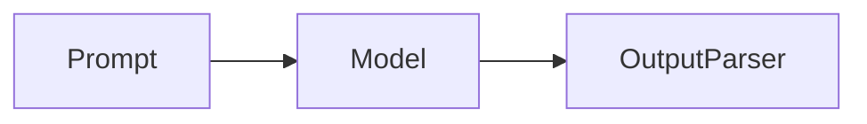
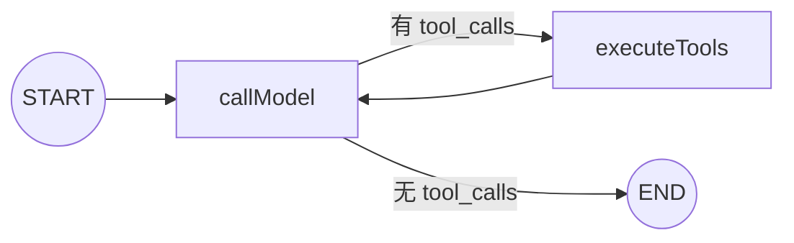
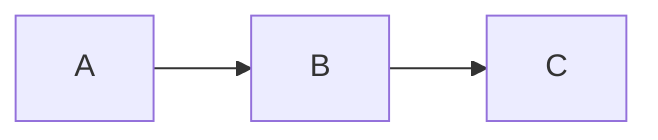
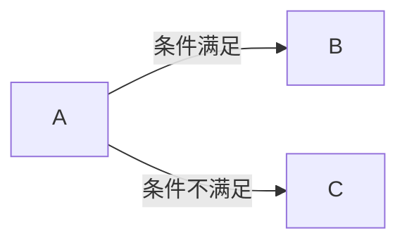
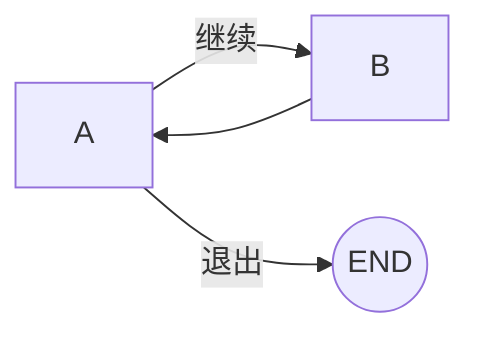
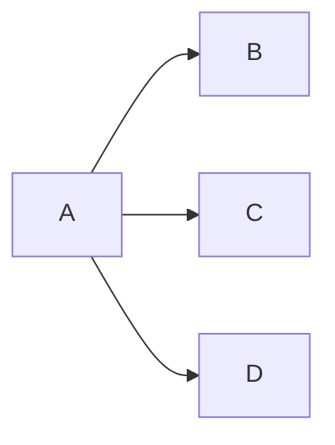
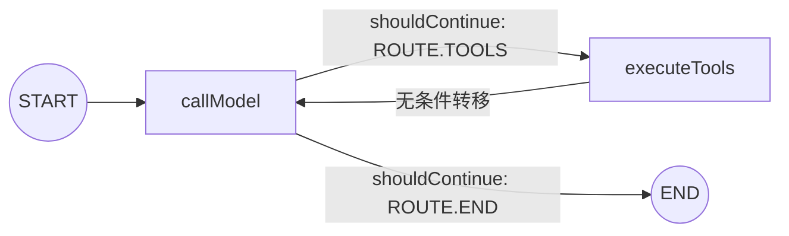
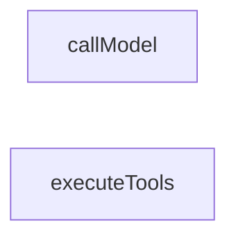
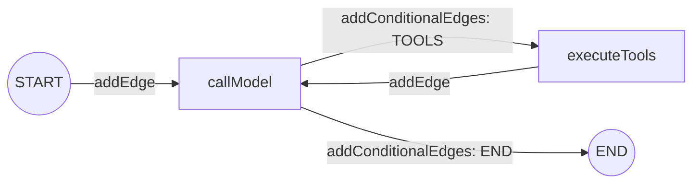
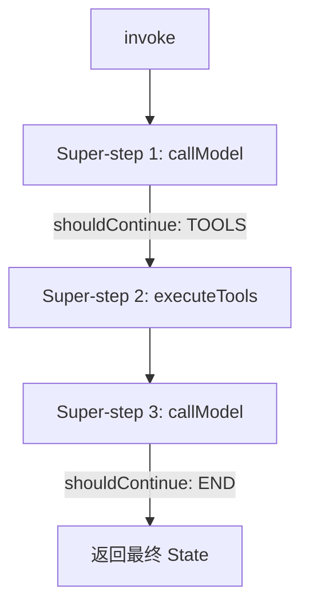

# 047. LangGraph 核心：状态图与图编排 (StateGraph Fundamentals)

## 1. 核心问题与概念 (The "Why")

### 解决什么问题

LCEL Chain 是线性管道（A → B → C），适合单链路任务。但智能体需要**决策、分支、循环**——模型需要判断是否调用工具、调用后还需要继续推理。

043 章节的 `ToolCallingLoop` 用 while 循环实现了这个逻辑，但存在根本性局限：

- **黑盒执行**：循环内部的每一步不可独立观测
- **不可中断**：无法在工具调用前暂停等待人工审批
- **不可持久化**：崩溃后无法从中间步骤恢复
- **不可可视化**：无法直观理解执行拓扑

StateGraph 将智能体从"线性管道 + while 循环"升级为"有限状态机"：

- 每一步都是**独立的、可观测的节点**
- 节点间的流转由**显式的条件边**驱动
- 图的执行状态可以在每个 super-step 边界**持久化**（049 章节）
- 任意节点可以**中断**等待人类输入（050 章节）

### 前置知识：图、拓扑与有限状态机

#### 什么是"图"（Graph）

在计算机科学中，**图（Graph）** 是一种描述"实体之间关系"的数据结构，由两部分组成：

- **节点（Node / Vertex）**：代表一个实体或处理单元
- **边（Edge）**：代表节点之间的连接关系

图的常见分类：

| 分类                                 | 特征                           | 与 LangGraph 的关系                                          |
| ------------------------------------ | ------------------------------ | ------------------------------------------------------------ |
| **有向图（Directed Graph）**   | 边有方向，A → B 不等于 B → A | StateGraph 的所有边都有方向，控制流单向流动                  |
| **无向图（Undirected Graph）** | 边无方向，A — B 双向可达      | LangGraph 不使用                                             |
| **有向无环图（DAG）**          | 有向 + 不存在环路              | 线性 Pipeline（A → B → C）属于 DAG                         |
| **有向有环图（Cyclic Graph）** | 有向 + 存在环路                | Agent 的核心就是环路：callModel → executeTools → callModel |

**图与管道的本质区别**：

LCEL Chain 本质是 DAG（有向无环图）的退化形式——线性链路 A → B → C，数据只能单向流动到终点。而 Agent 需要的是**有向有环图**：模型推理 → 判断是否需要工具 → 执行工具 → 回到模型推理。这个"环"正是 while 循环要表达的逻辑，但图结构能把这个环显式地声明出来，而不是隐藏在命令式代码中。

DAG（管道）—— 线性无环：



有向有环图（Agent）—— 存在循环：



在 LangGraph 的 StateGraph 中：

- **节点** = 处理步骤（如 `callModel`、`executeTools`）
- **边** = 步骤之间的控制流（如 `addEdge('executeTools', 'callModel')` 表示工具执行完后回到模型推理）
- **条件边** = 带决策逻辑的控制流（如 `shouldContinue` 决定走向 `executeTools` 还是 `END`）

#### 什么是"拓扑"与"执行拓扑"

**拓扑（Topology）** 在图论中指的是：**节点之间的连接结构和形状**，即"谁和谁相连、以什么方式相连"。拓扑不关心节点的具体内容，只关心结构关系。

**执行拓扑（Execution Topology）** 则是将拓扑概念应用到程序执行流程上：**处理步骤之间的连接模式和执行顺序**。

常见的执行拓扑模式：

**① 线性拓扑（Linear）**：LCEL Chain 的结构



**② 分支拓扑（Branching）**：`shouldContinue` 实现的条件路由



**③ 环形拓扑（Cyclic）**：`callModel` 与 `executeTools` 的 Agent 循环



**④ 并行扇出（Fan-out）**：同一 super-step 内多个节点并发执行



文档中提到的"无法直观理解**执行拓扑**"，指的是：用 while 循环写的代码，虽然逻辑上形成了"判断 → 执行工具 → 回到判断"的环形拓扑，但这个结构被埋在命令式控制流里，阅读代码时需要在脑中重建这个拓扑。而 StateGraph 通过 `addNode` + `addEdge` + `addConditionalEdges` 显式声明了执行拓扑，甚至可以通过 `getGraphAsync().drawMermaidPng()` 直接渲染成可视化图表。

#### 什么是"有限状态机"（Finite State Machine, FSM）

**有限状态机** 是一种计算模型，由以下要素组成：

- **有限个状态（States）**：系统在任意时刻只能处于其中一个状态
- **转移（Transitions）**：从一个状态切换到另一个状态的过程
- **触发条件（Events / Conditions）**：决定何时发生状态转移
- **初始状态（Initial State）**：系统启动时所在的状态
- **终止状态（Final State）**：系统到达后停止运行的状态

**FSM 的核心约束**：在任意时刻，系统**有且只有一个**当前状态。状态的切换必须通过预定义的转移规则，不能随意跳转。

**StateGraph 如何映射为 FSM**：

```
FSM 概念             StateGraph 对应
──────────────       ──────────────────────────────────────────
状态 (State)     →   节点 (Node): callModel、executeTools
转移 (Transition)→   边 (Edge): addEdge、addConditionalEdges
触发条件 (Event) →   路由函数: shouldContinue 的返回值
初始状态          →   START（通过 addEdge(START, 'callModel') 指定）
终止状态          →   END（通过条件边路由到 __end__ 到达）
状态数据快照      →   StateSchema（messages、iterationCount 等）
```

**FSM 视角下的 Agent 执行流程**：



1. 系统从 `[*]`（初始状态）进入 `callModel`
2. `callModel` 执行完毕后，`shouldContinue` 函数检查触发条件：
   - 如果 AI 返回了 `tool_calls` → 转移到 `executeTools` 状态
   - 如果没有 `tool_calls` 或达到最大迭代次数 → 转移到 `[*]`（终止状态）
3. `executeTools` 执行完毕后，**无条件转移**回 `callModel` 状态
4. 重复步骤 2-3，直到到达终止状态

**FSM 模型带来的工程优势**：

- **可预测性**：每个状态的出边和转移条件在编译时就已确定，运行时不会出现未定义的跳转
- **可观测性**：任意时刻都能知道系统处于哪个状态，每次状态转移都会发射 streaming event
- **可中断性**：可以在任意状态边界暂停执行，等待外部输入（如人工审批），然后从暂停点恢复
- **可持久化**：状态数据（StateSchema）可以在每次状态转移时序列化保存，崩溃后从最近的快照恢复

这正是文档开头提到的 while 循环不具备的四个能力：可观测、可中断、可持久化、可可视化。FSM 是实现这些能力的理论基础。

### 核心概念与依赖

| 概念              | 角色                                                            | 来源                     |
| ----------------- | --------------------------------------------------------------- | ------------------------ |
| `StateSchema`   | 定义图的共享数据结构，每个节点读取 State、返回 State 更新       | `@langchain/langgraph` |
| `MessagesValue` | 内置的消息列表 reducer，自动追加新消息                          | `@langchain/langgraph` |
| `ReducedValue`  | 自定义 reducer，解决并行节点写入冲突                            | `@langchain/langgraph` |
| `StateGraph`    | 图容器，接收 State + Node + Edge，compile 后可 invoke/stream    | `@langchain/langgraph` |
| `GraphNode`     | 节点类型约束，纯函数：`(state, config) => partialStateUpdate` | `@langchain/langgraph` |
| `entrypoint`    | Functional API 入口点，定义工作流的起始                         | `@langchain/langgraph` |
| `task`          | Functional API 副作用封装器，可持久化的执行单元                 | `@langchain/langgraph` |
| `contextSchema` | 运行时注入通道，通过 Zod Schema 约束从外部传入的配置            | `@langchain/langgraph` |

**包版本**：`@langchain/langgraph@^1.2.2`

## 2. 核心用法 / 方案设计 (Usage / Design)

### 前置知识：什么是 Reducer（归约函数）

#### 从 Array.reduce 说起

Reducer 是一个来自函数式编程的概念。它的本质是：**一个接收「当前累积值」和「新输入」，返回「下一个累积值」的函数**。

函数签名：`(currentValue, newInput) => nextValue`

JavaScript 原生的 `Array.reduce()` 就是这个概念的直接体现：

```typescript
const numbers = [1, 2, 3];

const sum = numbers.reduce((current, update) => current + update, 0);

// 执行过程：
// 第 1 次: reducer(0, 1) → 1    （初始值 0 + 第一个元素 1）
// 第 2 次: reducer(1, 2) → 3    （上一轮结果 1 + 第二个元素 2）
// 第 3 次: reducer(3, 3) → 6    （上一轮结果 3 + 第三个元素 3）
// 最终结果: 6
```

核心特征：**不是直接替换旧值，而是用一个函数定义「旧值 + 新值 → 合并后的值」的规则**。

#### 节点的返回值：Partial 对象（局部更新）

在之前的 LCEL 章节中，Runnable 的工作方式是：**接收一个输入，返回一个全新的输出**。每个 Runnable 产出的是一个完整的、独立的结果，传递给下一个 Runnable。

StateGraph 的节点工作方式完全不同：**所有节点共享同一份 State，每个节点只返回它想要更新的那几个字段**，而不是返回完整的 State。这个"只包含部分字段"的返回值，就叫 **Partial 对象**。

**Partial** 是 TypeScript 的一个内置工具类型，它的作用是：**把一个类型的所有属性变成可选的**。

```typescript
// 原始类型：所有字段必填
interface AgentState {
  messages: BaseMessage[];
  toolCallCount: number;
  iterationCount: number;
}

// Partial<AgentState>：所有字段变为可选
// 等价于：
interface PartialAgentState {
  messages?: BaseMessage[];
  toolCallCount?: number;
  iterationCount?: number;
}
```

在 StateGraph 中，节点的类型签名是 `(state: FullState) => Partial<FullState>`：

```typescript
// callModel 节点：接收完整 State，只返回需要更新的字段
const callModelNode = async (state) => {
  // state 是完整的：{ messages: [...], toolCallCount: 3, iterationCount: 1 }

  const aiMessage = await model.invoke(state.messages);

  // 返回 Partial 对象：只包含 messages 和 iterationCount
  // toolCallCount 没有返回 → 表示"这个字段我不更新"
  return {
    messages: [aiMessage],          // 更新 messages
    iterationCount: state.iterationCount + 1,  // 更新 iterationCount
    // toolCallCount — 不返回，保持原值
  };
};
```

**Runnable vs GraphNode 的返回值对比**：

| 维度 | Runnable（LCEL） | GraphNode（StateGraph） |
|------|-----------------|----------------------|
| 返回内容 | 完整的输出对象 | Partial 对象（State 的子集） |
| 未提及的字段 | 不存在"未提及"的概念 | 保持当前值不变 |
| 数据流向 | 输出传给下一个 Runnable | 返回值合并回共享 State |
| 合并方式 | 无需合并 | 由 Reducer 决定如何合并 |

这就引出了下一个问题：节点返回的 Partial 对象要**合并**回完整 State，那合并规则是什么？

#### 为什么 StateGraph 需要 Reducer

在 StateGraph 中，多个节点共享同一份 State，每个节点执行后返回一个 Partial 对象（局部更新）。问题来了：**当两个节点都往同一个字段写入时，结果应该是什么？**

以 `messages` 字段为例：

```
                  共享 State
                  messages: [HumanMessage("你好")]
                       │
            ┌──────────┴──────────┐
            ▼                     ▼
      callModel 节点         （假设另一个并行节点）
      返回: { messages:       返回: { messages:
        [AIMessage("回复")]     [SystemMessage("提示")] }
      }
            │                     │
            └──────────┬──────────┘
                       ▼
                  如何合并？
```

**没有 Reducer（Last-Write-Wins）**：后写入的覆盖先写入的。如果 callModel 先写、另一个节点后写，AI 的回复就丢了。

**有 Reducer（追加策略）**：用 concat 合并，最终 `messages` = `[HumanMessage, AIMessage, SystemMessage]`，没有数据丢失。

这就是 Reducer 在 StateGraph 中的作用：**定义状态字段的合并策略**，解决多个节点写入同一字段时的冲突问题。

#### 三种合并策略与 Reducer 的关系

| 策略 | 有无 Reducer | 合并规则 | 示例 |
|------|-------------|---------|------|
| 普通 Zod 字段 | 无 | Last-Write-Wins（后写覆盖） | `iterationCount: 3` 被后来的 `5` 覆盖 → 结果 `5` |
| `MessagesValue` | 内置 Reducer | 追加（concat） | `[msg1]` + `[msg2]` → `[msg1, msg2]` |
| `ReducedValue` | 自定义 Reducer | 你定义的任意函数 | `reducer(3, 2) → 5`（累加器） |

对应到实际代码中：

```typescript
const AgentState = new StateSchema({
  // 内置 Reducer：每次节点返回新消息，自动追加到末尾，不会覆盖历史
  messages: MessagesValue,

  // 自定义 Reducer：(current, update) => current + update
  // callModel 节点返回 { toolCallCount: 2 }，不是覆盖成 2，而是在原值上 +2
  toolCallCount: new ReducedValue(z.number().default(0), {
    reducer: (current: number, update: number) => current + update,
  }),

  // 无 Reducer：callModel 返回 { iterationCount: 3 }，直接覆盖旧值
  iterationCount: z.number().default(0),
});
```

理解了 Reducer，就能理解为什么 `messages` 字段不能用普通 Zod 字段——如果用 Last-Write-Wins，每个节点返回的消息会覆盖之前的对话历史，而不是追加。

### 场景 A: StateSchema — 三种 Value 类型

```typescript
import { StateSchema, MessagesValue, ReducedValue } from '@langchain/langgraph';
import * as z from 'zod';

const AgentState = new StateSchema({
  // MessagesValue: 内置消息 reducer，自动追加
  messages: MessagesValue,
  
  // ReducedValue: 自定义 reducer（累加器），并行写入安全
  toolCallCount: new ReducedValue(z.number().default(0), {
    reducer: (current: number, update: number) => current + update,
  }),
  
  // 普通 Zod 字段: Last-Write-Wins 语义
  iterationCount: z.number().default(0),
});
```

**三种 Value 的区别**：

| Value 类型        | 写入语义                           | 典型用途           |
| ----------------- | ---------------------------------- | ------------------ |
| `MessagesValue` | 追加（concat）+ 支持 RemoveMessage | 对话历史           |
| `ReducedValue`  | 自定义 reducer 函数                | 计数器、累加器     |
| 普通 Zod 字段     | Last-Write-Wins（覆盖）            | 状态标记、迭代计数 |

### 前置知识：StateGraph 构建方法详解

StateGraph 的构建过程是**声明式**的：你不是在编写"先执行 A 再执行 B"的命令式代码，而是在描述"图里有哪些节点、它们之间怎么连接"。所有方法都返回 `this`（Builder 模式），支持链式调用。

#### `new StateGraph(stateSchema, contextSchema?)` — 创建空图容器

```typescript
const graph = new StateGraph(AgentState, ContextSchema);
```

创建一个空的图容器。此时图里没有任何节点和边，只确定了两件事：
- **State 结构**：通过 `AgentState`（StateSchema）定义共享数据有哪些字段、每个字段的 Reducer 策略
- **Context 类型**（可选）：通过 `ContextSchema` 定义运行时注入的外部依赖的类型约束

#### `addNode(name, handler)` — 注册节点

```typescript
.addNode('callModel', callModelNode)
.addNode('executeTools', executeToolsNode)
```

向图中注册一个**命名节点**。参数说明：
- `name`：节点的唯一标识符，后续 `addEdge` / `addConditionalEdges` 通过这个名字引用它
- `handler`：一个 GraphNode 函数，签名为 `(state, config) => Partial<State>`

`addNode` 只是告诉图"存在这样一个处理步骤"，**不定义任何连接关系**。单独调用 `addNode` 不会让节点执行——节点必须通过边连入图的执行路径才会被触发。

#### `addEdge(from, to)` — 无条件边

```typescript
.addEdge(START, 'callModel')       // 图启动后，第一个执行 callModel
.addEdge('executeTools', 'callModel')  // executeTools 执行完后，回到 callModel
```

创建一条**无条件边**：`from` 节点执行完毕后，**必定**转移到 `to` 节点。没有判断逻辑，没有分支。

两个特殊常量：
- `START`：虚拟起点，不是真正的节点，代表"图开始执行时"。`addEdge(START, 'callModel')` 表示图启动后第一个执行的节点是 `callModel`
- `END`：虚拟终点，代表"图执行结束"。边指向 `END` 时，图在该路径上停止运行

#### `addConditionalEdges(source, routeFunction, routeMap)` — 条件边

```typescript
.addConditionalEdges('callModel', shouldContinue, {
  [ROUTE.TOOLS]: 'executeTools',   // shouldContinue 返回 'executeTools' → 走向 executeTools 节点
  [ROUTE.END]: END,                // shouldContinue 返回 '__end__'     → 走向 END，图结束
})
```

创建一条**条件边**，实现分支路由。三个参数：

| 参数 | 作用 | 示例 |
|------|------|------|
| `source` | 从哪个节点出发 | `'callModel'` |
| `routeFunction` | 路由函数，接收当前 State，返回一个字符串 key | `shouldContinue(state) → 'executeTools'` 或 `'__end__'` |
| `routeMap` | 将路由函数的返回值映射到目标节点 | `{ executeTools: 'executeTools', __end__: END }` |

执行过程：`callModel` 执行完毕 → 调用 `shouldContinue(state)` → 拿到返回值（如 `'executeTools'`）→ 在 `routeMap` 中查找 → 转移到 `'executeTools'` 节点。

路由函数 `shouldContinue` 的返回值**必须**是 `routeMap` 中的某个 key，否则运行时会抛出错误。

#### 调用顺序不影响执行顺序

```typescript
// 这两种写法的执行效果完全相同：
// 写法 A
.addNode('callModel', callModelNode)
.addNode('executeTools', executeToolsNode)
.addEdge(START, 'callModel')

// 写法 B（先加边，再加节点）
.addEdge(START, 'callModel')
.addNode('executeTools', executeToolsNode)
.addNode('callModel', callModelNode)
```

`addNode` / `addEdge` / `addConditionalEdges` 的**代码书写顺序不影响图的执行顺序**。这些方法只是在往图容器里"注册"节点和边，真正的执行顺序由边的连接关系决定。就像画一张地图——你先画城市还是先画道路，不影响最终地图上城市之间的距离。

#### `compile()` — 编译为可执行图

```typescript
const compiledGraph = graph.compile();
```

`compile()` 将声明式的图定义**编译为可执行的运行时实例**（`CompiledStateGraph`）。编译阶段做的事：

1. **校验完整性**：所有 `addEdge` / `addConditionalEdges` 引用的节点名是否都已通过 `addNode` 注册；`START` 是否有出边；是否存在无法到达的孤立节点
2. **构建执行计划**：分析边的连接关系，确定节点的执行拓扑（哪些节点可以并行、哪些必须串行）
3. **生成 Pregel 引擎实例**：底层转化为 Pregel 执行引擎，以 Super-step 为单位驱动节点执行（Pregel 和 Super-step 的详细解释见下方 Section 3）

编译后返回的 `CompiledStateGraph` 拥有 `invoke()` 和 `stream()` 方法，可以接收输入并执行：

```typescript
// invoke：同步执行到结束，返回最终 State
const result = await compiledGraph.invoke(
  { messages: [new HumanMessage('你好')] },
  { context: { model, tools, maxIterations: 5 } },
);

// stream：流式执行，逐节点返回 State 增量
const stream = await compiledGraph.stream(
  { messages },
  { context, streamMode: 'updates' },
);
```

未调用 `compile()` 的 StateGraph 实例只是一个"图的定义"，不能 invoke 或 stream。

#### 完整构建过程可视化

以 `tool-graph.builder.ts` 中的代码为例，三步构建过程：

**第一步：addNode — 注册节点**（此时节点之间没有任何连接）



**第二步：addEdge / addConditionalEdges — 连接边**（定义执行拓扑）



**第三步：compile() — 编译为可执行实例**，产出 `CompiledStateGraph`，拥有 `invoke()` / `stream()` 方法。

### 场景 B: Graph API — 声明式图构建

```typescript
import { StateGraph, START, END } from '@langchain/langgraph';

const graph = new StateGraph(AgentState, ContextSchema)
  .addNode('callModel', callModelNode)
  .addNode('executeTools', executeToolsNode)
  .addEdge(START, 'callModel')
  .addConditionalEdges('callModel', shouldContinue, {
    [ROUTE.TOOLS]: 'executeTools',
    [ROUTE.END]: END,
  })
  .addEdge('executeTools', 'callModel')
  .compile();

// 调用时通过 context 注入运行时配置
const result = await graph.invoke(
  { messages: [new HumanMessage('北京天气如何？')] },
  { context: { model, tools, maxIterations: 5 } },
);
```

### 场景 C: Functional API — 过程式范式

```typescript
import { entrypoint, task } from '@langchain/langgraph';

const callModelTask = task('callModel', async (params) => {
  const response = await params.model.bindTools(params.tools).invoke(params.messages);
  return new AIMessage({ content: response.content, tool_calls: response.tool_calls });
});

const executeToolsTask = task('executeTools', async (params) => {
  // 执行工具调用...
  return toolMessages;
});

const agent = entrypoint({ name: 'functionalToolAgent' }, async (input) => {
  let messages = input.messages;
  for (let i = 0; i < input.maxIterations; i++) {
    const aiMessage = await callModelTask({ model, tools, messages });
    messages.push(aiMessage);
    if (!aiMessage.tool_calls?.length) break;
    const toolResults = await executeToolsTask({ aiMessage, tools });
    messages.push(...toolResults);
  }
  return { messages, content: messages[messages.length - 1].content };
});
```

### 场景 D: contextSchema — NestJS DI 桥接

```typescript
// 1. 定义 contextSchema（Zod Schema）
const ContextSchema = z.object({
  model: z.custom<BaseChatModel>(),
  tools: z.array(z.custom<StructuredToolInterface>()),
  maxIterations: z.number().default(5),
});

// 2. 构建图时传入 contextSchema
const graph = new StateGraph(AgentState, ContextSchema)
  .addNode('callModel', callModelNode)
  .compile();

// 3. 节点中通过 config.context 访问
const callModelNode: GraphNode<typeof AgentState> = async (state, config) => {
  const { model, tools } = config.context; // 类型安全
  // ...
};

// 4. NestJS Service 层注入
const result = await graph.invoke(
  { messages },
  { context: { model: this.modelFactory.createChatModel(...), tools: this.toolRegistry.getTools() } },
);
```

### 场景 E: Graph 流式输出

```typescript
// streamMode: 'updates' — 逐节点返回 State 增量
const stream = await graph.stream(
  { messages },
  { context, streamMode: 'updates' },
);

for await (const chunk of stream) {
  // chunk 格式: { [nodeName]: partialStateUpdate }
  if (chunk.callModel) {
    const aiMsg = chunk.callModel.messages[0];
    if (aiMsg.tool_calls?.length) {
      // → 发射 TOOL_CALL 事件
    } else {
      // → 发射 TEXT 事件（最终回复）
    }
  }
  if (chunk.executeTools) {
    // → 发射 TOOL_RESULT 事件
  }
}
```

## 3. 深度原理与机制 (Under the Hood)

### 前置知识：Pregel 模型与 Super-step

#### 什么是 Pregel

**Pregel** 是 Google 提出的一种**图计算模型**（论文发表于 2010 年），专门用于在图结构上执行迭代计算。LangGraph 的底层运行时引擎就叫 Pregel——`compile()` 的产出本质上是一个 Pregel 实例。

Pregel 模型的核心思想很简单：

1. 图中的每个节点在每一轮中**读取当前状态、执行计算、写回状态更新**
2. 一轮结束后，所有状态更新被合并（通过 Reducer），产生新的全局状态
3. 基于新状态，决定下一轮哪些节点需要执行
4. 重复上述过程，直到没有节点需要执行（到达终止条件）

这里的"一轮"就是 **Super-step**。

#### 什么是 Super-step

**Super-step（超级步）** 是 Pregel 模型中的最小执行单位——图的一次"心跳"。每个 Super-step 内部发生三件事：

1. **执行**：当前轮次中所有"被激活"的节点并发执行，各自读取 State、返回 Partial 更新
2. **合并**：所有节点的 Partial 更新通过 Reducer 合并到共享 State 中
3. **路由**：根据边的定义（无条件边 / 条件边），决定下一个 Super-step 要激活哪些节点

Super-step 之间是图的**天然边界**——持久化（Checkpoint）和中断（Interrupt）都发生在这个边界上。

#### 用 Agent 的实际执行过程理解 Super-step

以"北京天气如何？"为例，图的执行被切分为多个 Super-step：



| Super-step | 执行的节点 | 节点输出 | 路由结果 |
|-----------|-----------|---------|---------|
| 1 | `callModel` | `AIMessage(tool_calls=[get_weather])` | `shouldContinue` → ROUTE.TOOLS → 激活 `executeTools` |
| 2 | `executeTools` | `ToolMessage("北京 25°C 晴")` | 无条件边 → 激活 `callModel` |
| 3 | `callModel` | `AIMessage(content="北京今天25°C，晴天")` | `shouldContinue` → ROUTE.END → 无节点被激活，图终止 |

每个 Super-step 之间，State 的快照可以被保存（049 章节的 Checkpointer），也可以被暂停等待人工输入（050 章节的 Interrupt）。这就是为什么 StateGraph 能实现可持久化和可中断——因为 Super-step 提供了清晰的"存档点"。

#### 为什么叫 "Pregel"

LangGraph 选择 Pregel 作为底层引擎名称，是因为它借鉴了 Google Pregel 的执行模型。但 LangGraph 的 Pregel 是一个**简化版本**：Google 的 Pregel 面向大规模分布式图计算（数十亿节点），LangGraph 的 Pregel 面向 AI Agent 工作流编排（通常几个到几十个节点）。核心执行模型相同，但规模和场景不同。

### Graph API vs Functional API

| 维度       | Graph API                                        | Functional API             |
| ---------- | ------------------------------------------------ | -------------------------- |
| 风格       | 声明式（addNode/addEdge）                        | 过程式（while/for + task） |
| 拓扑定义   | 编译前显式声明                                   | 隐含在代码流程中           |
| 可视化     | 原生支持（`getGraphAsync().drawMermaidPng()`） | 不直接支持                 |
| 持久化     | Checkpointer 自动管理                            | 通过 task() 实现           |
| 适用场景   | 复杂拓扑（分支、并行、子图）                     | 线性逻辑、快速原型         |
| 底层运行时 | 共享同一个 Pregel 引擎                           | 共享同一个 Pregel 引擎     |

### contextSchema 与 NestJS DI 的协作

```
NestJS DI 容器                    LangGraph 图运行时
┌──────────────┐                  ┌──────────────────┐
│ ConfigService│─> AiModelFactory │                  │
│              │     │            │ context.model    │
│              │     ▼            │ context.tools    │
│ ToolRegistry │─> getTools()──>  │ context.maxIter  │
└──────────────┘                  └──────────────────┘
                                      │
                                      ▼
                                    GraphNode 函数
                                  (state, config) => {
                                    config.context.model
                                    config.context.tools
                                  }
```

避免在 State 中存放非序列化对象（model 实例、工具实例等），因为：

- State 需要被 JSON 序列化到 Checkpoint
- model 和 tools 实例包含不可序列化的内部状态（TCP 连接、函数引用等）
- contextSchema 的值通过 invoke/stream 的参数传入，不参与持久化

### ToolCallingLoop vs StateGraph 对比

| 维度     | 043 ToolCallingLoop              | 047 StateGraph                           |
| -------- | -------------------------------- | ---------------------------------------- |
| 循环控制 | `for (i < maxIter)` 命令式     | `addConditionalEdges` 声明式           |
| 可观测性 | 整个循环是一个黑盒               | 每个节点独立发射 streaming event         |
| 中断能力 | 不支持                           | 支持（050 章节的 interrupt）             |
| 持久化   | 不支持                           | 支持（049 章节的 checkpointer）          |
| 流式粒度 | 中间轮用 invoke，最终轮用 stream | 所有节点统一通过 graph.stream("updates") |
| 定位     | 轻量级工具调用（简单场景仍有效） | Agent 级别编排（生产级复杂场景）         |

## 4. 最佳实践与坑 (Best Practices & Pitfalls)

- ✅ 用 `StateSchema` 定义状态（LangGraph v1 推荐方式，兼容 Zod v3/v4）
- ✅ 节点必须是纯函数：读取 State → 返回 partial State 更新，不修改传入 State
- ✅ 非序列化对象（model 实例、工具实例）通过 `contextSchema` 注入，不放入 State
- ✅ 用 `ReducedValue` 处理需要累加的字段（如 toolCallCount），避免并行写入丢失
- ✅ 条件边路由函数的返回值必须与 `addConditionalEdges` 的映射 key 完全匹配
- ❌ 不要在 State 中存放不可序列化的值（函数、类实例、TCP 连接等）
- ❌ 不要在节点内直接修改 `state` 对象（违反不可变性原则）
- ❌ 不要忘记 `.compile()` — 未编译的图不能 invoke/stream
- ❌ 不要在 Zod v4 中使用 `.langgraph.reducer()` 语法（那是 v3 专用的）

## 5. 行动导向 (Action Guide)

### Step 1: 安装 @langchain/langgraph

**这一步在干什么**: 引入 LangGraph 运行时，提供 StateGraph、GraphNode、entrypoint、task 等核心原语。

```bash
npm install @langchain/langgraph
```

### Step 2: 定义共享 State

**这一步在干什么**: 创建 `AgentState`，作为所有节点的共享数据快照。使用 `StateSchema` + `MessagesValue` + `ReducedValue` 三种 Value 类型。

文件：`src/ai/agents/shared/states/agent.state.ts`

```typescript
import { StateSchema, MessagesValue, ReducedValue } from '@langchain/langgraph';
import * as z from 'zod';

export const AgentState = new StateSchema({
  messages: MessagesValue,
  toolCallCount: new ReducedValue(z.number().default(0), {
    reducer: (current: number, update: number) => current + update,
  }),
  iterationCount: z.number().default(0),
});

export type AgentStateType = typeof AgentState;
```

### Step 3: 实现共享节点

**这一步在干什么**: 创建 `callModelNode`（调用 LLM）、`executeToolsNode`（执行工具）和 `shouldContinue`（条件路由），作为可复用的图构建模块。

文件：`src/ai/agents/shared/nodes/call-model.node.ts`

```typescript
import type { BaseChatModel } from '@langchain/core/language_models/chat_models';
import type { StructuredToolInterface } from '@langchain/core/tools';
import type { GraphNode } from '@langchain/langgraph';
import type { AIMessageChunk } from '@langchain/core/messages';
import { AIMessage } from '@langchain/core/messages';
import type { AgentStateType } from '../states/agent.state';

export interface ToolGraphContext {
  model: BaseChatModel;
  tools: StructuredToolInterface[];
  maxIterations: number;
}

export const callModelNode: GraphNode<AgentStateType> = async (state, config) => {
  const ctx = config?.context as ToolGraphContext;
  const { model, tools } = ctx;

  const modelToInvoke = tools.length > 0 && typeof model.bindTools === 'function'
    ? model.bindTools(tools)
    : model;

  const response = (await modelToInvoke.invoke(state.messages)) as AIMessageChunk;

  return {
    messages: [new AIMessage({
      content: typeof response.content === 'string' ? response.content : JSON.stringify(response.content),
      tool_calls: response.tool_calls,
      response_metadata: response.response_metadata,
      usage_metadata: response.usage_metadata,
    })],
    iterationCount: state.iterationCount + 1,
  };
};
```

文件：`src/ai/agents/shared/nodes/execute-tools.node.ts`

```typescript
import type { StructuredToolInterface } from '@langchain/core/tools';
import type { GraphNode } from '@langchain/langgraph';
import { AIMessage, ToolMessage } from '@langchain/core/messages';
import type { AgentStateType } from '../states/agent.state';
import type { ToolGraphContext } from './call-model.node';

export const executeToolsNode: GraphNode<AgentStateType> = async (state, config) => {
  const ctx = config?.context as ToolGraphContext;
  const lastMessage = state.messages[state.messages.length - 1];
  
  if (!(lastMessage instanceof AIMessage) || !lastMessage.tool_calls?.length) {
    return { messages: [], toolCallCount: 0 };
  }

  const toolMap = new Map<string, StructuredToolInterface>(ctx.tools.map(t => [t.name, t]));
  const toolMessages: ToolMessage[] = [];

  for (const toolCall of lastMessage.tool_calls) {
    const tool = toolMap.get(toolCall.name);
    const callId = toolCall.id ?? `tc_${Date.now()}`;
  
    try {
      const result = tool ? await tool.invoke(toolCall.args) : `工具 "${toolCall.name}" 不存在`;
      toolMessages.push(new ToolMessage({
        content: typeof result === 'string' ? result : JSON.stringify(result),
        tool_call_id: callId,
      }));
    } catch (error) {
      toolMessages.push(new ToolMessage({
        content: `工具执行出错: ${error instanceof Error ? error.message : String(error)}`,
        tool_call_id: callId,
      }));
    }
  }

  return { messages: toolMessages, toolCallCount: lastMessage.tool_calls.length };
};
```

文件：`src/ai/agents/shared/nodes/should-continue.ts`

```typescript
import { AIMessage, type BaseMessage } from '@langchain/core/messages';
import type { LangGraphRunnableConfig } from '@langchain/langgraph';

export const ROUTE = { TOOLS: 'executeTools', END: '__end__' } as const;

export function shouldContinue(
  state: { messages: BaseMessage[]; iterationCount: number },
  config?: LangGraphRunnableConfig,
): typeof ROUTE.TOOLS | typeof ROUTE.END {
  const lastMessage = state.messages[state.messages.length - 1];
  const maxIterations = (config?.context as { maxIterations?: number })?.maxIterations ?? 5;

  if (state.iterationCount >= maxIterations) return ROUTE.END;
  if (lastMessage instanceof AIMessage && lastMessage.tool_calls?.length) return ROUTE.TOOLS;
  return ROUTE.END;
}
```

### Step 4: 构建 StateGraph（Graph API）

**这一步在干什么**: 用声明式 API 将节点和边组装为可编译的状态图。`contextSchema` 定义了从 NestJS DI 注入的运行时参数类型。

文件：`src/ai/agents/single/tool-graph/tool-graph.builder.ts`

```typescript
import { StateGraph, START, END } from '@langchain/langgraph';
import * as z from 'zod';
import { AgentState } from '../../shared/states/agent.state';
import { callModelNode } from '../../shared/nodes/call-model.node';
import { executeToolsNode } from '../../shared/nodes/execute-tools.node';
import { shouldContinue, ROUTE } from '../../shared/nodes/should-continue';

const ContextSchema = z.object({
  model: z.custom<BaseChatModel>(),
  tools: z.array(z.custom<StructuredToolInterface>()),
  maxIterations: z.number().default(5),
});

export function buildToolGraph() {
  return new StateGraph(AgentState, ContextSchema)
    .addNode('callModel', callModelNode)
    .addNode('executeTools', executeToolsNode)
    .addEdge(START, 'callModel')
    .addConditionalEdges('callModel', shouldContinue, {
      [ROUTE.TOOLS]: 'executeTools',
      [ROUTE.END]: END,
    })
    .addEdge('executeTools', 'callModel')
    .compile();
}
```

### Step 5: 构建 Functional API Agent

**这一步在干什么**: 用 `entrypoint` + `task` 过程式范式实现等价逻辑。`task()` 将 LLM 调用和工具执行封装为可持久化单元。

文件：`src/ai/agents/single/tool-graph/functional-tool-agent.ts`

```typescript
import { entrypoint, task } from '@langchain/langgraph';

const callModelTask = task('callModel', async (params) => {
  // 调用 LLM（bindTools 后）
  return aiMessage;
});

const executeToolsTask = task('executeTools', async (params) => {
  // 执行工具调用
  return toolMessages;
});

export function buildFunctionalToolAgent() {
  return entrypoint({ name: 'functionalToolAgent' }, async (input) => {
    // while 循环 + task 调用
    // 与 Graph API 功能等价，但用过程式代码表达
  });
}
```

### Step 6: 创建 GraphService（NestJS 桥接层）

**这一步在干什么**: 在 NestJS DI 体系中管理编译后的图实例，将 `AiModelFactory` 和 `ToolRegistry` 的产出通过 `context` 注入图运行时。

文件：`src/ai/agents/graph.service.ts`

```typescript
@Injectable()
export class GraphService {
  private readonly toolGraph: ToolGraphCompiled;
  private readonly functionalAgent: FunctionalToolAgent;

  constructor(
    private readonly modelFactory: AiModelFactory,
    private readonly toolRegistry: ToolRegistry,
    private readonly configService: ConfigService,
  ) {
    // 图在构造时编译一次，运行时通过 context 切换 model/tools
    this.toolGraph = buildToolGraph();
    this.functionalAgent = buildFunctionalToolAgent();
  }

  async invokeGraph(params: GraphInvokeParams): Promise<GraphInvokeResult> {
    const model = this.modelFactory.createChatModel(params.provider, { ... });
    const tools = this.toolRegistry.getTools(params.toolNames);
    const context: ToolGraphContext = { model, tools, maxIterations: 5 };

    const result = await this.toolGraph.invoke(
      { messages },
      { context, callbacks: [tracer] },
    );
    // 提取最终 AIMessage 作为响应
  }

  streamGraph(params: GraphInvokeParams): Subject<StreamChunk> {
    // 使用 graph.stream({ ... }, { context, streamMode: 'updates' })
    // 将节点事件映射到 StreamChunk 协议
  }
}
```

### Step 7: 注册端点并验证

**这一步在干什么**: 创建独立的 `AgentController`（路由前缀 `ai/agent`），在 `AiModule` 注册 `AgentController` 和 `GraphService`。

Agent 阶段与 LCEL 阶段职责边界清晰：

- `/ai/*`       → AiController（038 过程式 API）
- `/ai/lcel/*`  → LcelController（041-046 LCEL 管道）
- `/ai/agent/*` → AgentController（047+ LangGraph 图编排）

新增 API 端点：

- `POST /ai/agent/graph/chat` — Graph API 非流式
- `POST /ai/agent/graph/chat/stream` — Graph API 流式 SSE
- `POST /ai/agent/graph/functional/chat` — Functional API 非流式

验证请求体（与 043 工具调用请求一致的字段）：

```json
{
  "provider": "siliconflow",
  "model": "Pro/MiniMaxAI/MiniMax-M2.5",
  "messages": [
    { "role": "user", "content": "北京今天天气怎么样？现在几点了？" }
  ],
  "systemPrompt": "你是一个智能助手，可以使用工具来帮助用户。",
  "tools": ["get_current_time", "get_weather"],
  "maxIterations": 5
}
```
