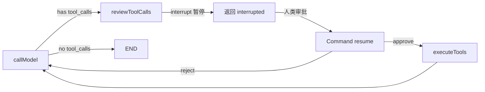
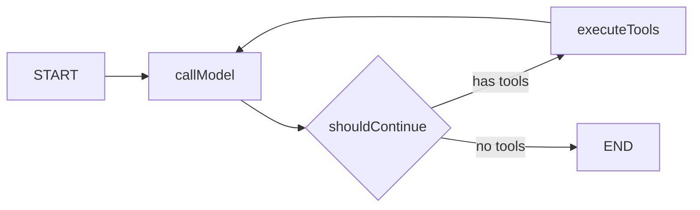
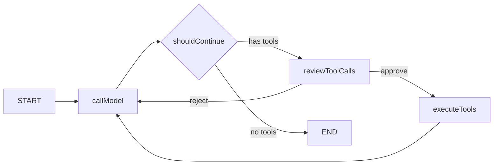
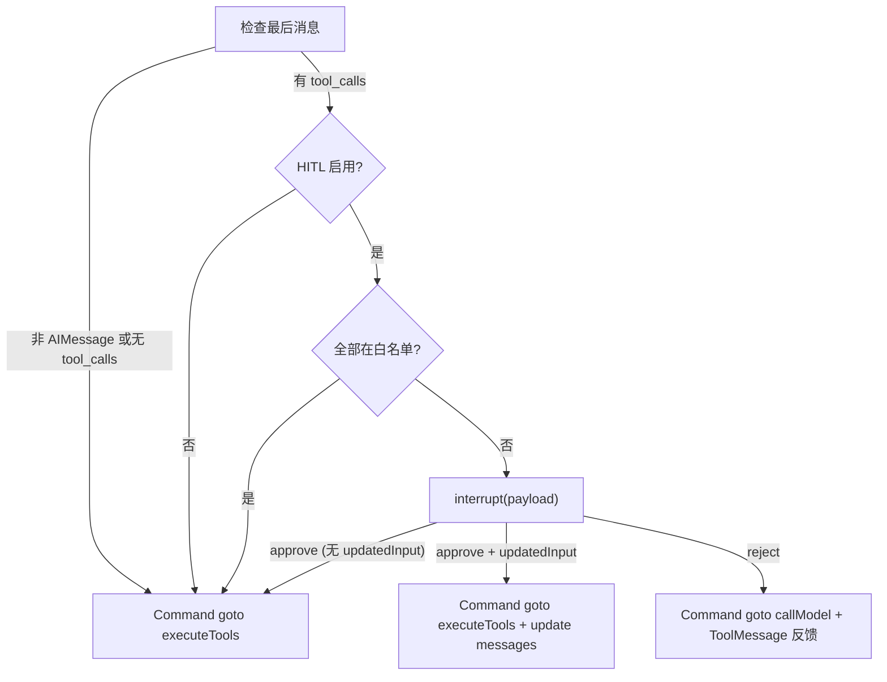

# 050. 人机协同模式 (Human-in-the-Loop Patterns)

## 1. 核心问题与概念 (The "Why")

### 解决什么问题

049 的 Durable Execution 赋予了 Agent 断点续传和状态持久化能力，但所有执行仍然是**全自动**的——Agent 自主决定调用哪些工具、传什么参数、执行什么操作。这在生产环境中引入了三个关键风险：

1. **不可逆操作风险**：Agent 可能直接发送邮件、下单付款、删除数据库记录，这类操作一旦执行无法撤回
2. **幻觉导致的错误工具调用**：模型可能因幻觉调用错误的工具或传入错误的参数（如查北京天气变成查火星天气）
3. **合规与审计需求**：金融、医疗等行业要求关键操作必须经过人类确认，Agent 的自主执行不满足审计要求

### 核心概念与依赖

| 概念                           | 定义                                                                       | 与项目已有能力的关系                                       |
| ------------------------------ | -------------------------------------------------------------------------- | ---------------------------------------------------------- |
| **interrupt()**          | LangGraph 提供的动态中断函数，在图节点内调用后暂停执行，将载荷返回给调用方 | 依赖 049 的 checkpointer 保存暂停点状态                    |
| **Command({ resume })**  | 恢复被 interrupt() 暂停的图执行，resume 值成为 interrupt() 的返回值        | 是 invoke() 的特殊输入格式                                 |
| **Command({ goto })**    | 从节点返回时动态选择下一个目标节点（替代静态 addEdge）                     | 配合 `{ ends: [...] }` 声明可达节点                      |
| **__interrupt__**  | invoke() 返回值中的特殊字段，包含所有 pending 的中断载荷                   | 服务层据此判断返回 completed 还是 interrupted              |
| **reviewToolCalls 节点** | 本项目自建的审批中断节点，插入在 callModel → executeTools 之间            | 复用 047 的 callModel/executeTools/shouldContinue 共享节点 |
| **autoApproveTools**     | 免审批工具白名单，低风险工具（如查时间）跳过 interrupt 直接执行            | 实现分层审批策略                                           |

### interrupt() 的前置条件

interrupt() 能够暂停并恢复图执行，**本质上依赖 049 章节建立的 checkpointer 持久化基础**。没有 checkpointer，运行时没有地方保存暂停点的图状态，也就无法在之后恢复。

LangGraph 官方文档明确列出 interrupt() 正常工作的三个前提：

1. 节点内调用 `interrupt()`
2. 调用时传入稳定的 `thread_id`（用于定位 checkpoint）
3. 图必须配置 `checkpointer`

环境选择上存在梯度：

| 环境      | checkpointer  | 效果                                                      |
| --------- | ------------- | --------------------------------------------------------- |
| 不配置    | 无            | interrupt() 抛出的异常无人保存，**HITL 完全不可用** |
| 开发/测试 | MemorySaver   | 可以正常中断和恢复，但进程重启后暂停点丢失                |
| 生产      | PostgresSaver | 暂停点持久化到数据库，进程重启后仍可恢复                  |

因此 050 对 049 存在硬依赖——HITL 图构建器将 `checkpointer` 设为必传参数（而非 049 中的可选参数），在类型层面强制约束。

### interrupt() 运行机制

interrupt() 的底层实现是一个特殊异常——调用时抛出异常中断执行流，被 LangGraph 运行时捕获后保存状态。恢复时，整个节点从头重新执行，直到遇到 interrupt() 时检测到已有 resume 值，直接返回该值而非再次暂停。

```text
首次执行:
  reviewToolCalls 开始 → ... → interrupt(payload) → 抛异常 → 运行时保存状态 → 返回 __interrupt__

恢复执行 (Command({ resume: decision })):
  reviewToolCalls 重新开始 → ... → interrupt(payload) → 检测到 resume 值 → 返回 decision → 继续执行后续逻辑
```

关键约束：

- interrupt() **不可**被 try/catch 包裹（会吞掉暂停异常）
- interrupt() 之前的代码在恢复时会**重新执行**，必须保证幂等性
- 同一节点内多个 interrupt() 的匹配是**基于索引顺序**的，禁止条件跳过

## 2. 核心用法 / 方案设计 (Usage / Design)

### 审批模型设计决策：为什么是二元而非三元

调研 2025-2026 年生产级 Agent 平台的审批模型后得出结论——**行业标准是二元决策（allow / deny）**，不存在独立的 "edit" 动作：

| 平台              | 审批动作                                                            | 参数修改能力          |
| ----------------- | ------------------------------------------------------------------- | --------------------- |
| Claude Code       | y (允许) / n (拒绝) / a (会话级始终允许) / d (会话级始终拒绝)       | 无                    |
| Claude Agent SDK  | `PermissionResultAllow(updated_input)` / `PermissionResultDeny(message)` | 内嵌在 allow 的 `updated_input` 中 |
| OpenAI Agents SDK | `approve(interruption)` / `reject(interruption)` + `alwaysApprove` / `alwaysReject` 粘性决策 | 无                    |
| Cursor            | Accept / Accept for session / Reject                                | 无                    |

因此本项目的 `ReviewAction` 只有两个值：

- **approve**：批准执行。可选携带 `updatedInput`（修改后的工具参数），对齐 Claude Agent SDK 的 `PermissionResultAllow(updated_input=...)`
- **reject**：驳回执行。可选携带 `reason`（驳回原因），对齐 OpenAI Agents SDK 的 `reject({ message })`

把"参数修改"作为 approve 的可选增强而非独立动作，原因是：

1. 实际场景中审批人修改参数的频率极低，多数情况下 reject 并让模型重新推理更自然
2. 独立的 edit 动作增加了 UI 复杂度——需要为用户提供 JSON 参数编辑界面
3. Claude Agent SDK 验证了"allow + optional updated_input"的设计足够覆盖所有场景

### 场景 A: 工具调用审批（Approve）

最常见的 HITL 场景：Agent 决定调用工具后，暂停让人类审批。

**流程概述：**



**服务端代码：**

```typescript
// 首次调用 — 可能在 reviewToolCalls 节点中断
const result = await hitlService.invoke(
  {
    provider: 'siliconflow',
    model: 'Pro/MiniMaxAI/MiniMax-M2.5',
    messages: [{ role: 'user', content: '帮我查一下北京天气' }],
  },
  { threadId: 'uuid-here' },
);

// result.status === 'interrupted'
// result.interrupt.toolCalls === [{ name: 'get_weather', args: { city: '北京' } }]

// 审批人批准后恢复执行
const resumed = await hitlService.resume(
  { threadId: 'uuid-here' },
  { action: 'approve' },
  { provider: 'siliconflow', model: 'Pro/MiniMaxAI/MiniMax-M2.5', messages: [] },
);
// resumed.status === 'completed'
// resumed.content === '北京今天天气晴朗，温度 25°C。'
```

### 场景 B: 批准并修改参数（Approve + updatedInput）

审批人发现工具参数有误，批准执行但用修正后的参数替换原始调用。对齐 Claude Agent SDK 的 `PermissionResultAllow(updated_input=...)` 模式。

```typescript
const resumed = await hitlService.resume(
  { threadId: 'uuid-here' },
  {
    action: 'approve',
    updatedInput: [
      { id: 'tc_abc123', name: 'get_weather', args: { city: '上海' } },
    ],
  },
  { provider: 'siliconflow', model: '...', messages: [] },
);
```

### 场景 C: 驳回并反馈（Reject）

审批人认为不需要调用工具，驳回并提供原因。模型会收到反馈后重新推理。

```typescript
const resumed = await hitlService.resume(
  { threadId: 'uuid-here' },
  {
    action: 'reject',
    reason: '不需要查天气，请直接根据常识回答',
  },
  { provider: 'siliconflow', model: '...', messages: [] },
);
```

### 场景 D: 逐工具审批（Per-tool Decisions）

模型一次生成多个 tool_calls 时，审批人可为每个工具调用提交独立的 approve/reject 决策。

**为什么不用每个工具一个 interrupt？**

LangGraph 官方明确规定："**Do not loop interrupt() calls using logic that isn't deterministic across executions**"。我们的 `autoApproveTools` 来自 context 而非 state，重放时可能变化，循环 interrupt 有索引错位风险。Cursor/Claude Code 的"逐个审批"实际上是因为模型每轮通常只生成 1 个 tool_call（模型行为），不是后端做了逐工具中断。OpenAI Agents SDK 的 interruptions 数组也是一次返回、客户端逐个呈现。

**因此，正确的生产级设计是：单次 interrupt + 逐工具决策的 resume 值。** 客户端如何呈现（一次全部 / 逐个 / 分组）是前端关切。

```typescript
// 逐工具审批 — 批准 get_weather，驳回 send_email
const resumed = await hitlService.resume(
  { threadId: 'uuid-here' },
  [
    { toolCallId: 'tc_abc', action: 'approve' },
    { toolCallId: 'tc_def', action: 'reject', reason: '不要发邮件' },
  ],
  { provider: 'siliconflow', model: '...', messages: [] },
);
```

**混合决策的路由策略：**

| 情况 | 路由目标 | 行为 |
| ---- | -------- | ---- |
| 全部 approve | executeTools | 正常执行（有 updatedArgs 时替换参数） |
| 全部 reject | callModel | 每个 tool_call 生成 ToolMessage 拒绝反馈 |
| 混合 | callModel | 每个 tool_call 生成复合 ToolMessage 反馈（标注审批状态），模型据此只重试已批准的工具 |

混合决策不采用"只执行已批准工具"的方案，因为会产生与 tool_call_id 不匹配的孤立 ToolMessage，违反 LLM 提供商的消息协议约束。

### 场景 E: 免审批工具白名单

低风险工具（如查时间）通过 `autoApproveTools` 跳过审批。

```typescript
const result = await hitlService.invoke(
  {
    messages: [{ role: 'user', content: '现在几点了？' }],
    autoApproveTools: ['get_current_time'],
    // ...
  },
  { threadId: 'uuid-here' },
);
// 直接返回 completed，无 interrupt
```

## 3. 深度原理与机制 (Under the Hood)

### HITL 图拓扑 vs 原始 ToolGraph

**原始图（047 buildToolGraph）：**



**HITL 图（050 buildHitlToolGraph）：**



核心差异：在 shouldContinue 判定"需要工具调用"后，插入 `reviewToolCalls` 节点。该节点使用 `interrupt()` 暂停图执行，等待人类输入后通过 `Command({ goto })` 动态路由。

### 节点重放 vs 图路由（关键区分）

"恢复时节点从头执行"容易产生误解，这里精确说明**重放的边界**：

```text
首次执行（一路正常跑到 interrupt 处暂停）:

  START → callModel → shouldContinue → reviewToolCalls
                                            │
                                        interrupt() 暂停
                                        checkpoint 保存此刻的图状态
                                            │
                                        返回 __interrupt__ 给调用方

恢复执行（Command({ resume: decision })）:

  ┌──────────────────────────────────────────────────────────
  │ 运行时从 checkpoint 加载图状态       
  │                                      
  │ 只重新调用 reviewToolCalls 这一个节点函数  
  │ ├─ 函数从头执行（读 state、构建 payload...）   
  │ ├─ 再次遇到 interrupt() → 检测到 resume 值 → 直接返回  
  │ └─ 函数继续执行后续路由逻辑 → 返回 Command({ goto: ... })   
  │                                                    
  │ callModel / shouldContinue 不会重新执行         
  │ 它们的结果已经在 checkpoint 里了                   
  └──────────────────────────────────────────────────────────
                          │
              ┌───────────┴───────────┐
              │                       │
        goto: executeTools      goto: callModel
           (approve)              (reject)
              │                       │
              ▼                       ▼
        正常继续图执行            正常继续图执行
```

重放粒度总结：

- **重放的是**：包含 `interrupt()` 的那一个节点函数（`reviewToolCalls`），从函数入口到函数返回
- **不重放的是**：该节点之前已经完成的节点（`callModel`、`shouldContinue`），它们的执行结果已持久化在 checkpoint 中
- **不重放的是**：整张图的所有 super-step。checkpoint 保存的是节点边界状态，恢复时直接跳到中断节点

这就是为什么 interrupt() 节点的幂等性要求只针对**节点函数内部**，而不需要担心 `callModel` 等上游节点的副作用。

### reviewToolCalls 节点内部流程



### Command 动态路由机制

LangGraph 的 `Command` 类让节点在运行时决定下一个执行的节点，替代静态的 `addEdge`：

```typescript
// 声明时通过 ends 告知图构建器可能的路由目标
.addNode('reviewToolCalls', reviewToolCallsNode, {
  ends: ['executeTools', 'callModel'],
})

// 运行时通过 Command 选择具体路由
return new Command({ goto: 'executeTools' });          // 批准
return new Command({ goto: 'callModel', update: {...} }); // 驳回 + 状态更新
```

`Command` 的 `update` 字段允许在路由时同时更新图状态——驳回场景中，将 ToolMessage 反馈注入 messages，让模型在下一轮看到审批人的意见。

### 节点重放语义：为什么从头执行是生产标准

恢复时"整个节点从头重新执行"是 LangGraph 的**官方设计决策**，而非实现局限。其背后的工程理据：

1. **简化状态快照粒度**：checkpoint 只需保存节点边界的状态，不需要保存节点内部的执行上下文（栈帧、局部变量），极大降低了持久化的复杂度和存储开销。
2. **确保确定性**：从节点入口开始执行，配合不可变的 State 输入，保证每次重放得到相同的中间结果。如果从 interrupt() 行直接继续，则依赖运行时精确恢复 JS 执行上下文，这在跨进程/跨机器场景下几乎不可能。
3. **与 Durable Execution 对齐**：Temporal、Azure Durable Functions 等工业级持久化执行框架均采用"活动（Activity）级别重放"而非"行级别恢复"的策略，LangGraph 的节点重放语义与之一致。

这个语义在生产上不是问题，前提是节点满足可重放设计。

### 幂等性保障

interrupt() 恢复时整个节点从头执行，因此节点设计必须满足**可重放**（幂等性）要求。reviewToolCalls 节点的设计是一个标准范例：

- interrupt() 之前的操作全部是**纯读取**（读 state、构建 payload），没有外部副作用
- 没有数据库写入、API 调用、日志写入等非幂等操作
- 节点输出完全由 resume 值决定，多次执行结果一致

如果节点内确实需要副作用，生产上的标准做法按优先级排列：

1. **副作用后置**：将副作用放在 interrupt() 之后（恢复后只执行一次）
2. **副作用外移**：拆到独立的后续节点（如 `approval → sideEffect → ...`），让审批节点保持纯净
3. **幂等化处理**：使用 upsert 替代 insert，使用幂等 API 调用（如带唯一请求 ID 的支付接口）

### HTTP 层的 interrupt/resume 协议

```text
Client                          Server
  |                                |
  |-- POST /hitl/chat -----------> |  invoke() → interrupt()
  |<-- { status: "interrupted",    |
  |      interrupt: { toolCalls } }|
  |                                |
  |  (人类审批)                     |
  |                                |
  |-- POST /hitl/resume ---------> |  resume() → Command({ resume })
  |<-- { status: "completed",      |
  |      content: "..." }          |
  |                                |
```

流式版本通过 SSE 事件传递：

- `META` → `TEXT` → `TOOL_CALL` → `INTERRUPT` → `DONE`（首次调用）
- `META` → `TOOL_RESULT` → `TEXT` → `DONE`（恢复执行）

## 4. 最佳实践与坑 (Best Practices & Pitfalls)

- ✅ 将 interrupt() 放在节点的最前面或中间，确保之前的代码无副作用
- ✅ 使用 `autoApproveTools` 白名单减少低风险工具的审批频率
- ✅ interrupt 的载荷使用纯 JSON 可序列化对象（字符串、数组、对象）
- ✅ 驳回时提供清晰的 reason，帮助模型在下一轮推理中修正
- ✅ 为每次 HITL 对话使用独立的 threadId（UUID v4）
- ❌ 禁止将 interrupt() 放在 try/catch 内（会吞掉暂停异常）
- ❌ 禁止在 interrupt() 前执行非幂等操作（如 INSERT、发邮件）
- ❌ 禁止在节点内条件性跳过 interrupt()（破坏索引匹配）
- ❌ 禁止将函数、类实例等不可序列化对象传入 interrupt()

## 5. 行动导向 (Action Guide)

### Step 1: 确保 Durable Execution 基础就绪

**这一步在干什么**：HITL 依赖 049 的 checkpointer 持久化暂停点状态。确保 PostgresSaver（或 MemorySaver）已配置。

```bash
# env.ai 中确认以下配置
AI_CHECKPOINT_ENABLED=true
AI_CHECKPOINT_DURABILITY_MODE=sync
```

### Step 2: 理解新增文件组织

**这一步在干什么**：050 新增了 HITL 图构建器、审批节点、服务层和 DTO。

```
src/ai/agents/
├── hitl/                           # 050 HITL 服务层
│   ├── hitl.types.ts               # 审批决策、中断载荷等类型定义
│   ├── hitl.service.ts             # HITL 生命周期管理（invoke/resume/stream）
│   └── index.ts
│
├── single/
│   └── hitl-graph/                 # 050 HITL 图
│       ├── hitl-graph.builder.ts   # 带 reviewToolCalls 的图构建器
│       ├── review-tools.node.ts    # interrupt() 审批节点
│       └── index.ts

src/ai/dto/
└── hitl.dto.ts                     # HITL 请求/响应 DTO

src/ai/constants/ai.constants.ts    # StreamChunkType.INTERRUPT 新增
src/ai/interfaces/provider.interface.ts  # InterruptPayload 新增
```

### Apipost 已验证流程与参数

**这一步在干什么**：把本次已经在 Apipost 中实际跑通的请求体固定下来，后续复测时直接复用相同参数即可。当前仅验证了**批量审批**路径：非流式 `chat -> resume` 和流式 `chat/stream -> resume/stream`；`reject`、`updatedInput`、`toolDecisions` 暂未纳入本轮实测记录。

固定测试参数：

```json
{
  "provider": "siliconflow",
  "model": "Pro/MiniMaxAI/MiniMax-M2.5",
  "threadId": "550e8400-e29b-41d4-a716-446655440001"
}
```

推荐在 Apipost 中准备 4 个请求并按下面顺序手动联调：

1. `POST /ai/agent/hitl/chat`
2. `POST /ai/agent/hitl/resume`
3. `POST /ai/agent/hitl/chat/stream`
4. `POST /ai/agent/hitl/resume/stream`

其中第 1、3 步用于触发中断，第 2、4 步用于提交批量审批 `decision: { "action": "approve" }` 恢复执行。

### Step 3: HITL 首次对话（触发中断）

**这一步在干什么**：通过 `/ai/agent/hitl/chat` 端点发起 HITL 对话。当 Agent 决定调用工具时，执行在 reviewToolCalls 节点暂停。

```bash
# 生成 UUID
THREAD_ID=$(uuidgen)

curl -X POST http://localhost:3000/ai/agent/hitl/chat \
  -H "Content-Type: application/json" \
  -d '{
    "provider": "siliconflow",
    "model": "Pro/MiniMaxAI/MiniMax-M2.5",
    "threadId": "'$THREAD_ID'",
    "messages": [{"role": "user", "content": "帮我查一下北京现在的天气"}],
    "autoApproveTools": ["get_current_time"]
  }'
```

预期响应：

```json
{
  "status": "interrupted",
  "threadId": "550e8400-...",
  "interrupt": {
    "type": "tool_call_review",
    "toolCalls": [
      { "id": "tc_abc", "name": "get_weather", "arguments": { "city": "北京" } }
    ],
    "message": "Agent 请求调用 1 个工具，请审批。"
  }
}
```

Apipost 实测请求体（非流式，批量审批链路的第 1 步）：

```json
{
  "provider": "siliconflow",
  "model": "Pro/MiniMaxAI/MiniMax-M2.5",
  "threadId": "550e8400-e29b-41d4-a716-446655440001",
  "messages": [
    {
      "role": "user",
      "content": "帮我查一下北京现在的天气"
    }
  ]
}
```

### Step 4: 审批恢复执行

**这一步在干什么**：审批人确认工具调用后，通过 `/ai/agent/hitl/resume` 端点恢复执行。

```bash
# 批准执行
curl -X POST http://localhost:3000/ai/agent/hitl/resume \
  -H "Content-Type: application/json" \
  -d '{
    "threadId": "'$THREAD_ID'",
    "provider": "siliconflow",
    "model": "Pro/MiniMaxAI/MiniMax-M2.5",
    "decision": { "action": "approve" }
  }'
```

预期响应：

```json
{
  "status": "completed",
  "threadId": "550e8400-...",
  "content": "北京现在天气晴朗，温度 25°C，湿度 45%。",
  "iterationCount": 2,
  "toolCallCount": 1
}
```

Apipost 实测请求体（非流式，批量审批链路的第 2 步）：

```json
{
  "threadId": "550e8400-e29b-41d4-a716-446655440001",
  "provider": "siliconflow",
  "model": "Pro/MiniMaxAI/MiniMax-M2.5",
  "decision": {
    "action": "approve"
  }
}
```

### Step 5: 驳回或修改参数场景

**这一步在干什么**：测试 reject 和 approve + updatedInput 审批决策路径。

```bash
# 驳回 — 模型将收到反馈重新推理
curl -X POST http://localhost:3000/ai/agent/hitl/resume \
  -H "Content-Type: application/json" \
  -d '{
    "threadId": "'$THREAD_ID'",
    "provider": "siliconflow",
    "model": "Pro/MiniMaxAI/MiniMax-M2.5",
    "decision": {
      "action": "reject",
      "reason": "不需要查天气，请根据常识回答"
    }
  }'

# 批准并修改参数（对齐 Claude SDK PermissionResultAllow(updated_input)）
curl -X POST http://localhost:3000/ai/agent/hitl/resume \
  -H "Content-Type: application/json" \
  -d '{
    "threadId": "'$THREAD_ID'",
    "provider": "siliconflow",
    "model": "Pro/MiniMaxAI/MiniMax-M2.5",
    "decision": {
      "action": "approve",
      "updatedInput": [
        { "id": "tc_abc", "name": "get_weather", "args": { "city": "上海" } }
      ]
    }
  }'
```

### Step 6: 逐工具审批（Per-tool Decisions）

**这一步在干什么**：当模型一次提出多个工具调用时，为每个工具提交独立审批。

```bash
# 逐工具审批 — 批准 get_weather，驳回 send_email
curl -X POST http://localhost:3000/ai/agent/hitl/resume \
  -H "Content-Type: application/json" \
  -d '{
    "threadId": "'$THREAD_ID'",
    "provider": "siliconflow",
    "model": "Pro/MiniMaxAI/MiniMax-M2.5",
    "toolDecisions": [
      { "toolCallId": "tc_abc", "action": "approve" },
      { "toolCallId": "tc_def", "action": "reject", "reason": "不要发邮件" }
    ]
  }'
```

混合决策时，模型会收到复合反馈，在下一轮只重试已批准的工具。

### Step 7: 流式 HITL 对话

**这一步在干什么**：通过 SSE 流式端点进行 HITL 对话，实时接收 token 和中断事件。

```bash
# 流式首次调用
curl -N -X POST http://localhost:3000/ai/agent/hitl/chat/stream \
  -H "Content-Type: application/json" \
  -d '{
    "provider": "siliconflow",
    "model": "Pro/MiniMaxAI/MiniMax-M2.5",
    "threadId": "'$THREAD_ID'",
    "messages": [{"role": "user", "content": "帮我查北京天气"}]
  }'

# 流式恢复
curl -N -X POST http://localhost:3000/ai/agent/hitl/resume/stream \
  -H "Content-Type: application/json" \
  -d '{
    "threadId": "'$THREAD_ID'",
    "provider": "siliconflow",
    "model": "Pro/MiniMaxAI/MiniMax-M2.5",
    "decision": { "action": "approve" }
  }'
```

SSE 事件序列：

```
data: {"type":"meta","meta":{"threadId":"..."}}
data: {"type":"text","content":"我来"}
data: {"type":"text","content":"查一下"}
data: {"type":"tool_call","toolCall":{"name":"get_weather","arguments":{"city":"北京"}}}
data: {"type":"interrupt","interrupt":{"type":"tool_call_review","toolCalls":[...],"message":"..."}}
data: {"type":"done","trace":{...}}
data: [DONE]
```

Apipost 实测请求体（流式，批量审批链路）：

```json
{
  "provider": "siliconflow",
  "model": "Pro/MiniMaxAI/MiniMax-M2.5",
  "threadId": "550e8400-e29b-41d4-a716-446655440001",
  "messages": [
    {
      "role": "user",
      "content": "帮我查北京天气"
    }
  ]
}
```

```json
{
  "threadId": "550e8400-e29b-41d4-a716-446655440001",
  "provider": "siliconflow",
  "model": "Pro/MiniMaxAI/MiniMax-M2.5",
  "decision": {
    "action": "approve"
  }
}
```
